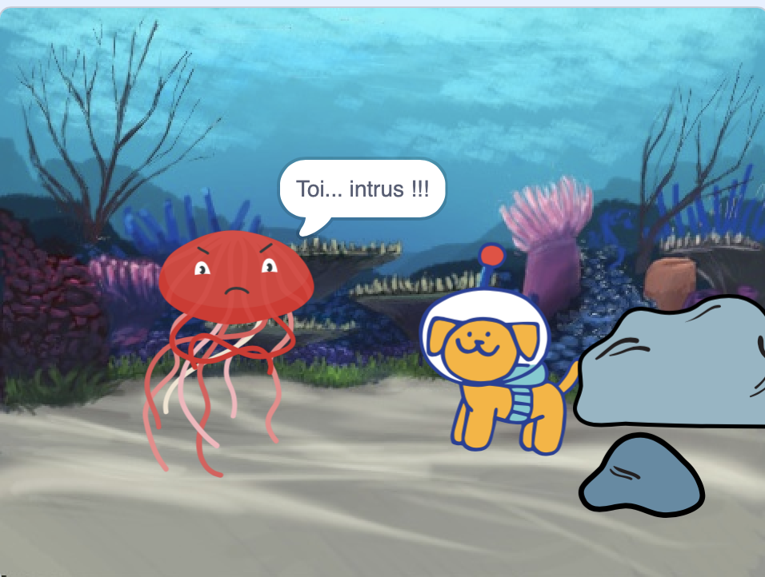

## Améliorer ton projet

Tu peux améliorer ton projet en ajoutant une réaction. Comment réagira ton personnage principal ? 

C'est toi qui décides !

--- task ---

Qu'est-ce qu'ils vont faire ? Vont-ils dire quelque chose, faire du bruit, changer de costume ou bouger ?

[[[scratch3-change-costumes-to-show-mood]]]

[[[scratch3-graphic-effects]]]

[[[scratch3-text-to-speech]]]

[[[scratch3-animate-movement-costumes]]]

[[[scratch3-add-sound]]]

[[[scratch3-record-sound]]]

--- /task ---

--- task ---

Tu pourrais aussi :
+ Ajouter ou améliorer ton animation, avec des mouvements, des apparences et des effets graphiques
+ Créer ou modifier des costumes dans l'éditeur de peinture pour leur donner l'apparence que tu souhaites
+ Enregistrer ta voix ou enregistrer des effets sonores et ajouter les nouveaux sons à ton projet

--- /task ---

Les programmeurs professionnels explorent et s'inspirent du code créé par d'autres programmeurs. 

--- task ---

Tu peux également consulter les remixes du [projet de démarrage animation Surprise](https://scratch.mit.edu/projects/582222532/remixes){:target="_blank"} pour voir ce que d'autres créateurs ont fait.

--- /task ---

--- task ---

Chaque projet dans le studio Scratch [Surprise ! animation : exemples](https://scratch.mit.edu/studios/29075822){:target="_blank"} a un lien **Voir à l'intérieur**, que tu peux utiliser pour ouvrir le projet dans l'éditeur Scratch et regarder le code pour avoir des idées et voir comment le projet fonctionne.

  <iframe allowtransparency="true" width="485" height="402" src="" frameborder="0"></iframe>

--- /task ---

--- task ---

Jete un œil à notre studio Scratch [Surprise ! animation : communauté](https://scratch.mit.edu/studios/29079784){:target="_blank"} pour voir les projets créés par les membres de la communauté.

--- /task ---

