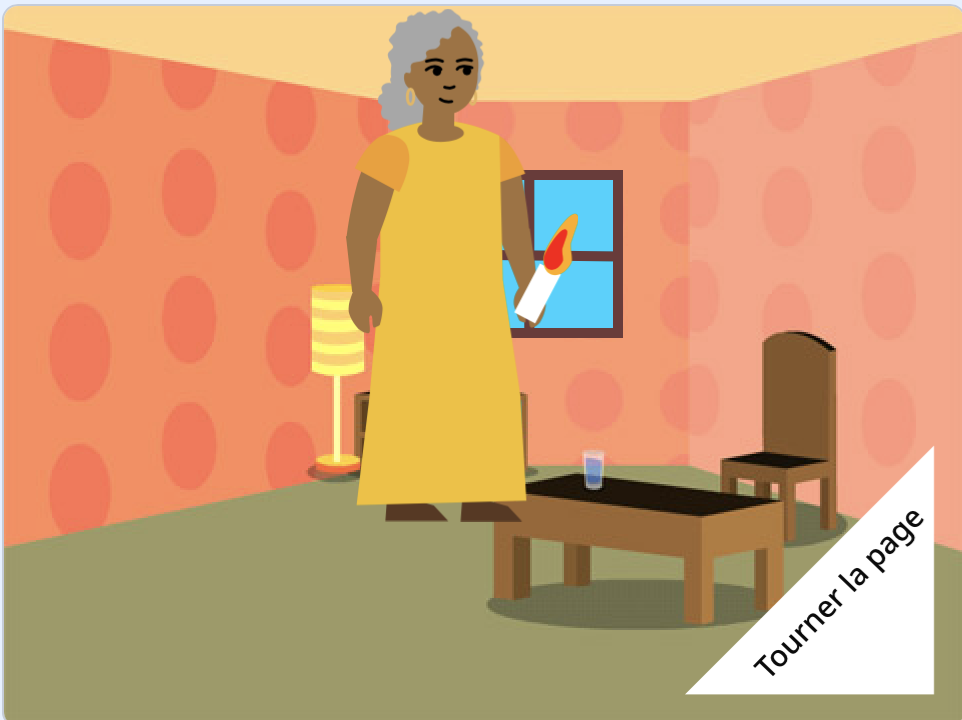

## Et ensuite ?

Si tu suis le chemin [Introduction de Scratch](https://projects.raspberrypi.org/en/pathway/scratch-intro), tu peux passer au projet [Je t'ai fait un livre](https://projects.raspberrypi.org/en/projects/i-made-you-a-book). Dans ce projet, tu vas créer un livre à ta propre idée basé sur Scratch .

--- no-print ---

**Éclairer le chemin du retour** : [Voir à l'intérieur](https://scratch.mit.edu/projects/499860786/editor){:target="_blank"}

  <iframe allowtransparency="true" width="485" height="402" src="https://scratch.mit.edu/projects/embed/499860786/?autostart=false" frameborder="0"></iframe>

--- /no-print ---

--- print-only ---

--- /print-only ---

Si tu veux t'amuser davantage à explorer Scratch, tu peux essayer l'un de [ces projets](https://projects.raspberrypi.org/en/projects?software%5B%5D=scratch&curriculum%5B%5D=%201).

