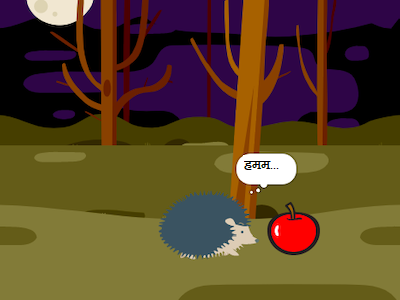

## You will make

मज़ेदार सरप्राइज़ के साथ एक छोटा एनिमेशन 🎥 बनाएं

आप करेंगे:

+ अपना खुद का एनीमेशन बनाएं
+ Test and debug your code
+ Build your animation one part at a time

--- no-print ---

--- task ---

  

प्ले ▶️ एनिमेशन देखने के लिए हरे झंडे पर क्लिक करें।

एनीमेशन के तीन भाग हैं: + जिज्ञासा + आश्चर्य! + प्रतिक्रिया
+ Reaction

**Dinosaur surprise!**: [See inside](https://scratch.mit.edu/projects/495932563/editor){:target="_blank"}

  <iframe allowtransparency="true" width="485" height="402" src="https://scratch.mit.edu/projects/embed/495932563/?autostart=false" frameborder="0"></iframe>

--- /task ---

### Get ideas 💭

--- task ---

Play with these example projects to get ideas. Think about what your animation might be, and explore these example projects to get more ideas:

⭐ Share your finished Surprise animation project for a chance of it being featured here.

**BOO!**: [See inside](https://scratch.mit.edu/projects/498655116/editor){:target="_blank"}

  <iframe allowtransparency="true" width="485" height="402" src="https://scratch.mit.edu/projects/embed/498655116/?autostart=false" frameborder="0"></iframe>

**Cat magic**: [See inside](https://scratch.mit.edu/projects/498615133/editor){:target="_blank"}

  <iframe allowtransparency="true" width="485" height="402" src="https://scratch.mit.edu/projects/embed/498615133/?autostart=false" frameborder="0"></iframe>

**⭐ Jumpscare!**: [See inside](https://scratch.mit.edu/projects/720220722/editor){:target="_blank"} (featured community project)

  <iframe allowtransparency="true" width="485" height="402" src="https://scratch.mit.edu/projects/embed/720220722/?autostart=false" frameborder="0"></iframe>

--- /task ---

--- /no-print ---

--- print-only ---

### Get ideas 💭

आप डिज़ाइन संबंधी निर्णय लेंगे और आश्चर्य के साथ अपने एनिमेशन के लिए एक कहानी के बारे में सोचेंगे। इस बारे में सोचें कि आपकी कहानी क्या हो सकती है, और अधिक विचार प्राप्त करने के लिए, **अंदर देखें** उदाहरण प्रोजेक्ट है आश्चर्य के अंदर एनिमेशन - उदाहरण 'स्क्रैच स्टूडियो: https://scratch.mit.edu/studios/29075822/

The animation has three parts:
+ जिज्ञासा
+ आश्चर्य!
+ Reaction

 

--- /print-only ---

 
