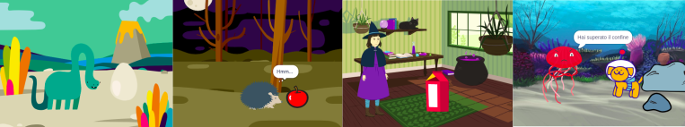

## Quello che farai

Crea una breve animazione 🎥 con una sorpresa divertente 🎉!

Tu:

+ Crea la tua animazione
+ Prova a debuggare il tuo codice
+ Costruisci la tua animazione una pezzo alla volta

--- no-print ---

--- task ---

  

### Gioca ▶️ 

Clicca sulla bandierina verde per guardare l'animazione.

L'animazione è composta da tre parti:
+ Curiosità
+ Sorpresa!
+ Reazione

  <iframe allowtransparency="true" width="485" height="402" src="" frameborder="0"></iframe>

--- /task ---

### Lasciati ispirare 💭

--- task ---

Gioca con questi progetti di esempio per trovare l'ispirazione. Pensa a quale potrebbe essere la tua animazione ed esplora questi progetti di esempio per avere più idee:

⭐ Condividi il tuo progetto finito di animazione sorprendente per avere la possibilità che venga mostrato qui.

  <iframe allowtransparency="true" width="485" height="402" src="" frameborder="0"></iframe>

  <iframe allowtransparency="true" width="485" height="402" src="" frameborder="0"></iframe>

  <iframe allowtransparency="true" width="485" height="402" src="" frameborder="0"></iframe>

--- /task ---

--- /no-print ---

--- print-only ---

### Lasciati ispirare 💭

Prenderai decisioni di progettazione e penserai a una storia per la tua animazione con una sorpresa. Pensa a quale potrebbe essere la tua storia e per avere più idee, **Guarda dentro** ai progetti di esempio nella sezione 'Sorpresa! animazione - Studio Scratch di esempi: https://scratch.mit.edu/studios/29075822/

L'animazione è composta da tre parti:
+ Curiosità
+ Sorpresa!
+ Reazione

 

--- /print-only ---

 
