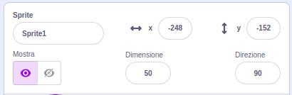
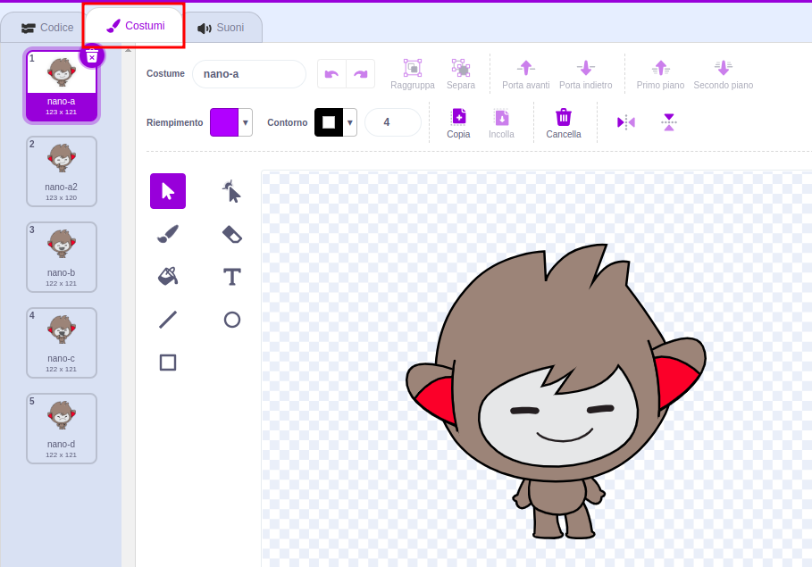
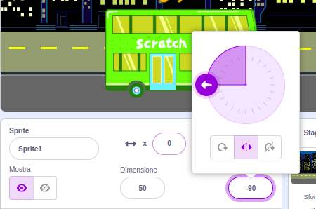

## Crea la tua scena

Hai un'idea per la tua animazione?

Aggiungi uno sfondo 🖼️, un personaggio principale 🐙👩‍🦼🦖 e un oggetto interessante 🎂🎾🎁 a tua scelta per creare la **prima parte** della tua animazione.


<p style="border-left: solid; border-width:10px; border-color: #0faeb0; background-color: aliceblue; padding: 10px;">
  Un'<span style="color: #0faeb0">**Animazione**</span> crea l'effetto del movimento cambiando rapidamente le immagini. I primi animatori intagliavano figure da blocchi di legno e le usavano come stampi. È molto più veloce usare Scratch per programmare la tua animazione!
</p>

### Apri il progetto iniziale

--- task ---

Apri il [ progetto iniziale Sorpresa! animazione](https://scratch.mit.edu/projects/582222532/editor){:target="_blank"}.

⏱️ Hai poco tempo? Puoi iniziare da uno degli [esempi](https://scratch.mit.edu/studios/29075822){:target="_blank"}.

--- /task ---

<p style="border-left: solid; border-width:10px; border-color: #0faeb0; background-color: aliceblue; padding: 10px;">
Ci sono persone chiamate <span style="color: #0faeb0">**designer narrativi**</span> che si occupano di storytelling per app e videogiochi. Il digital storytelling consente a tutti di condividere le proprie storie e la propria immaginazione creativa con altre persone.
</p>

### Progetta la tua scena

--- task ---

**Scegli:** un tema per la tua animazione. Potresti scegliere:

+ 🐯Animali terrestri
+ 🐠 Animali marini
+ 👽 Alieni
+ 🌿 Natura
+ 🌈 Meteo
+ 🌮 Cibo
+ 🚀 Viaggi
+ ⚾ Sport .... O qualcos'altro

--- /task ---

--- task ---

**Scegli:** Scegli uno sprite che sia il 🐙👩‍🦼🦖 **personaggio principale**, un altro sprite che sia l' 🎂🎾🎁 **oggetto interessante** e uno 🖼️ **sfondo** per ambientare la scena.


--- /task ---

### Prepara i tuoi sprite

Da dove vuoi che cominci il tuo sprite? Quanto grandi saranno? Come vuoi che appaiano?

--- task ---

Aggiungi un blocco `quando si clicca sulla bandierina verde`{:class="block3events"} poi, sotto, aggiungi i blocchi per impostare i tuoi sprite all'inizio dell'animazione.

**Suggerimento:** Ricordati di impostare sia il tuo 🐙👩‍🦼🦖 **personaggio principale** sia i tuoi 🎂🎾🎁 **oggetti interessanti**.

--- collapse ---
---
title: Posiziona i tuoi sprite
---

Sposta il 🐙👩‍🦼🦖 **personaggio principale** nella posizione che preferisci sullo stage, quindi aggiungi un blocco `vai a x: y:`{:class="block3motion"} al tuo codice:

```blocks3
go to x: (0) y: (0) // add the sprite's position
```

Ripeti questo processo per l'🎂🎾🎁 **oggetto interessante**.

--- /collapse ---

--- collapse ---
---
title: Ridimensiona i tuoi sprite
---

Per modificare la dimensione di uno sprite per l'intero progetto, modifica il numero nella proprietà **Dimensione** nel riquadro Sprite:



Per modificare la dimensione di uno sprite per una parte del progetto, aggiungi il blocco `porta la dimensione a`{:class="block3looks"} e imposta la dimensione che preferisci. Questa opzione è utile se vuoi che il tuo sprite cambi dimensione nel progetto.

```blocks3
set size to [100] % // <100 is smaller, >100 is bigger
```

--- /collapse ---

--- collapse ---
---
title: imposta i costumi dei tuoi sprite
---

Per cambiare il costume di uno sprite per l'intero progetto, clicca sulla scheda **Costumi** e seleziona uno dei costumi disponibili:



Per cambiare il costume di uno sprite per una parte del progetto, aggiungi un blocco `passa al costume`{:class="block3looks"} al tuo codice e aggiornalo per mostrare il costume di tua scelta:

```blocks3
switch costume to [ v]  // update this for your chosen costume
```

Per nascondere uno sprite all'inizio del progetto, aggiungi un blocco `nascondi`{:class="block3looks"} al tuo codice:

```blocks3
hide 
```

--- /collapse ---

--- collapse ---
---
title: Imposta la direzione dei tuoi sprite
---

I tuoi sprite potrebbero essere rivolti nella direzione sbagliata quando li aggiungi al tuo progetto.

Per cambiare la direzione di uno sprite per l'intero progetto, cambia la **Direzione** e lo **stile di rotazione** nel riquadro degli Sprite:



Per cambiare la direzione di uno sprite per una parte del progetto, aggiungi i blocchi `usa stile rotazione`{:class="block3motion"} e `punta in direzione`{:class="block3motion"}:

```blocks3
set rotation style [left-right v]
point in direction (-90) // turn to the left
```

--- /collapse ---

--- /task ---

--- task ---

Salva il tuo progetto.

[[[generic-scratch3-saving]]]

--- /task ---
