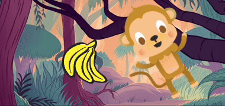

## Aggiungi una sorpresa!

Ora devi aggiungere una sorpresa. Cosa potrebbe succedere all'oggetto?
- Si trasformerà in un altro oggetto?
- Diventerà un personaggio?
- Scomparirà e rivelerà un altro sprite?

Lo decidi tu! Crea la **terza parte** della tua animazione.


<p style="border-left: solid; border-width:10px; border-color: #0faeb0; background-color: aliceblue; padding: 10px;">
Hai scritto una storia con un colpo di scena o una sorpresa? Hai guardato uno spettacolo o letto un libro con un finale imprevedibile? Puoi utilizzare gli stessi metodi quando crei una storia digitale o un'animazione. 
</p>

### Quando avverrà la sorpresa?

--- task ---

Seleziona lo sprite dell'🎂🎾🎁 **oggetto interessante**. Aggiungi uno script per far iniziare la sorpresa quando vuoi.

Dovrai scegliere la durata della pausa adatta al tuo progetto. Se il tuo personaggio resta per molto tempo incuriosito, dovrai scegliere un'attesa più lunga.

```blocks3
when flag clicked
wait (5) seconds // change the number to create your time delay
```

--- /task ---

### Ora crea la sorpresa!

--- task ---

L'oggetto può `riprodurre un suono`{:class="block3sound"}, `cambiare costume`{:class="block3looks"}, `cambiare effetti grafici`{:class="block3looks"} o `cambiare dimensione`{:class="block3looks"}.

Potresti aggiungere un costume sorprendente allo sprite, poi lo sprite potrebbe `cambiare costume`{:class="block3looks"} per rivelarlo.



[[[scratch3-add-costumes-to-a-sprite]]]

Potresti far sembrare che lo sprite si trasformi in uno sprite diverso: per fare ciò, `nascondi`{:class="block3looks"} lo sprite dell' 🎂🎾🎁 **oggetto interessante** nello stesso momento in cui si `mostra`{:class= "block3looks"} un altro sprite.

--- collapse ---
---
title: Mostra e nascondi gli sprite
---

Lo sprite dell' 🎂🎾🎁 **oggetto interessante**:
```blocks3
when flag clicked
show
wait (5) seconds
hide
```

Lo sprite dell'🎷👻⚡**oggetto sorpresa**:
```blocks3
when flag clicked
hide
wait (5) seconds
show
```

**Suggerimento:** Se usi nell' 🎷👻⚡**oggetto sorpresa** il blocco `mostra`{:class="block3looks"}, dovrai farlo `nascondere`{:class="block3looks"} `quando fai clic sulla bandierina verde`{:class="block3events"}.

--- /collapse ---

--- /task ---

--- task ---

**Prova:** Clicca sulla bandierina verde. La sorpresa arriva al momento giusto? L'animazione si ripristina correttamente?

--- /task ---

--- task ---

**Debug:**

Se hai bisogno che uno sprite sia davanti o dietro un altro sprite, puoi usare i livelli:

[[[scratch3-positioning-with-layers]]]

Se la sorpresa arriva nel momento sbagliato, puoi sistemarla:

--- collapse ---
---
title: La sorpresa inizia nel momento sbagliato
---

Potresti dover modificare la quantità di tempo in alcuni o tutti i blocchi `attendi`{:class="block3control"} o aggiungere altri blocchi `attendi`{:class="block3control"} per ottenere i tempi giusti.

--- /collapse ---

--- /task ---

