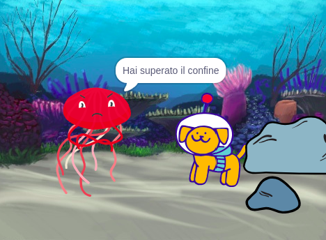

## Migliora il tuo progetto

Potresti aggiornare il tuo progetto aggiungendo una reazione. Come reagirà il personaggio principale? 

Lo decidi tu!

--- task ---

Cosa faranno? Diranno qualcosa, emetteranno un suono, cambieranno costumi o si muoveranno?

[[[scratch3-change-costumes-to-show-mood]]]

[[[scratch3-graphic-effects]]]

[[[scratch3-text-to-speech]]]

[[[scratch3-animate-movement-costumes]]]

[[[scratch3-add-sound]]]

[[[scratch3-record-sound]]]

--- /task ---

--- task ---

Potresti anche:
+ Aggiungere qualcosa o migliorare la tua animazione, con movimento, aspetto ed effetti grafici
+ Creare o modificare i costumi nell'editor Paint per farli apparire come desideri
+ Registrare la tua voce o registrare effetti sonori e aggiungere i nuovi suoni al tuo progetto

--- /task ---

I programmatori professionisti esplorano e prendono ispirazione dal codice creato da altri sviluppatori. 

--- task ---

Puoi anche guardare i remix per il [progetto iniziale di animazione Sorpresa](https://scratch.mit.edu/projects/582222532/remixes){:target="_blank"} per vedere cosa hanno realizzato altri creatori.

--- /task ---

--- task ---

Ogni progetto della serie ['Sorpresa! animazione: Esempi in Scratch studio](https://scratch.mit.edu/studios/29075822){:target="_blank"} ha un collegamento **Guarda dentro**, che puoi utilizzare per aprire il progetto nell'editor di Scratch e guardare il codice per avere idee e vedere come funziona il progetto.

  <iframe allowtransparency="true" width="485" height="402" src="" frameborder="0"></iframe>

--- /task ---

--- task ---

Dai un'occhiata alla nostra ['Sorpresa! animazione — Community' Scratch studio](https://scratch.mit.edu/studios/29079784){:target="_blank"} per vedere i progetti creati dai membri della comunità.

--- /task ---

