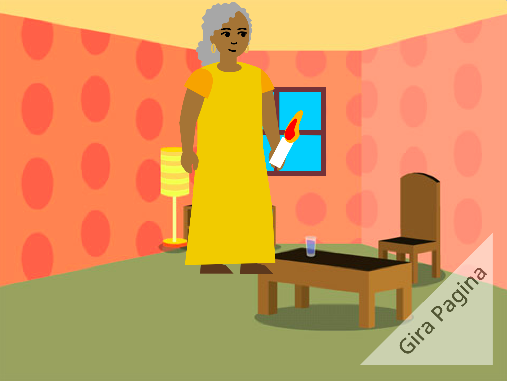

## E adesso?

Se stai seguendo il percorso [Introduzione a Scratch](https://projects.raspberrypi.org/en/pathway/scratch-intro), puoi passare al progetto [Ho creato un libro per te](https://projects.raspberrypi.org/en/projects/i-made-you-a-book). In questo progetto, realizzerai un libro in Scratch basato su una tua idea.

--- no-print ---

  <iframe allowtransparency="true" width="485" height="402" src="" frameborder="0"></iframe>

--- /no-print ---

--- print-only ---

--- /print-only ---

Se vuoi divertirti ancora di più esplorando Scratch, puoi provare uno qualsiasi di [questi progetti](https://projects.raspberrypi.org/en/projects?software%5B%5D=scratch&curriculum%5B%5D=%201).

