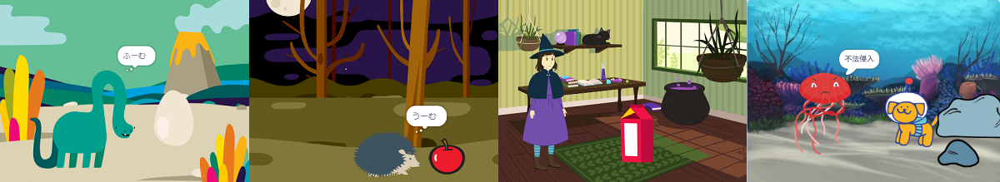
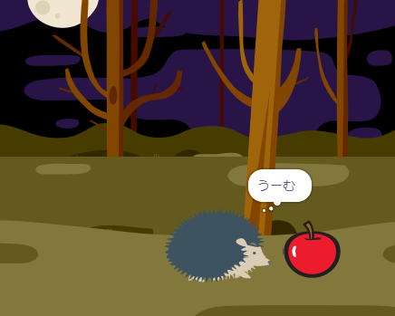

## はじめに

サプライズのある、短いアニメーションを作成します。

あなたは次のことを行います。

+ スクラッチを使用してアニメーションを作成する
+ 変更を加えるときにコードをテストしてデバッグする
+ アニメーションを部品に分け（これは **分解** と呼ばれます）、一度に1つの部品を作成します

--- no-print ---

--- task ---

  

### 試してみる▶️

緑色の旗をクリックしてアニメーションをご覧ください。

アニメーションは3つの部分で構成されています。
+ 好奇心
+ 驚き！
+ 反応

**恐竜サプライズ！**：[中を見る](https://scratch.mit.edu/projects/642712326/editor){:target="_blank"}

  <iframe allowtransparency="true" width="485" height="402" src="https://scratch.mit.edu/projects/embed/495932563/?autostart=false" frameborder="0"></iframe>

--- /task ---

### インスピレーションを得る

--- task ---

サンプルプロジェクトを試してアイディアを得ましょう。 どんなアニメーションになるか考えて、サンプルプロジェクトを通してもっとアイデアを得ましょう。

⭐ 完成したサプライズプロジェクトを共有すると、ここで紹介される可能性があります。

**侵入者**： [中を見る](https://scratch.mit.edu/projects/642713367/editor){:target="_blank"}

  <iframe allowtransparency="true" width="485" height="402" src="https://scratch.mit.edu/projects/embed/498655116/?autostart=false" frameborder="0"></iframe>

**ばぁ！**： [中を見る](https://scratch.mit.edu/projects/642711066/editor){:target="_blank"}

  <iframe allowtransparency="true" width="485" height="402" src="https://scratch.mit.edu/projects/embed/498615133/?autostart=false" frameborder="0"></iframe>

**猫の魔法**： [中を見る](https://scratch.mit.edu/projects/642711441/editor){:target="_blank"}

  <iframe allowtransparency="true" width="485" height="402" src="https://scratch.mit.edu/projects/embed/720220722/?autostart=false" frameborder="0"></iframe>

--- /task ---

--- /no-print ---

--- print-only ---

### インスピレーションを得る

サプライズのあるアニメーションのデザインを決めて、ストーリーを考えます。 あなたのストーリーがどんなものになるか考え、より多くのアイデアを得るために、 **「サプライズ！」** のサンプルプロジェクトの中を見てみましょう。 アニメーション — スクラッチスタジオの例：https://scratch.mit.edu/studios/29075822/

アニメーションには4つの部品があります。
+ 好奇心
+ サプライズ！
+ 反応

 

--- /print-only ---

 
