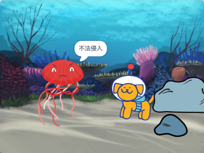

## はじめに

サプライズのある、短いアニメーションを作成します。

あなたは次のことを行います。

+ スクラッチを使用してアニメーションを作成する
+ 変更を加えるときにコードをテストしてデバッグする
+ アニメーションを部品に分け（これは **分解** と呼ばれます）、一度に1つの部品を作成します

  **分解** とはプロジェクトをより小さく、理解しやすい部品に分けることです。 これは、プロジェクトが完成するまで、一度に一つの部品ずつプロジェクトをビルドできることを意味します。 

--- no-print ---

--- task ---

  

アニメーションを見るには、緑色の旗をクリックしてください。

アニメーションには4つの部品があります：
+セットアップ
+好奇心
+サプライズ！
+ リアクション

**恐竜サプライズ！**：[中を見る](https://scratch.mit.edu/projects/495932563/editor){:target="_blank"}

  <iframe allowtransparency="true" width="485" height="402" src="https://scratch.mit.edu/projects/embed/495932563/?autostart=false" frameborder="0"></iframe>

--- /task ---

### インスピレーションを得る

--- task ---

サプライズのあるアニメーションのデザインを決めて、ストーリーを考えます。

あなたのストーリーがどんなものになるか考え、サンプルプロジェクトを参考により多くのアイデアを得てください。

**ばぁ！**： [中を見る](https://scratch.mit.edu/projects/498655116/editor){:target="_blank"}

  <iframe allowtransparency="true" width="485" height="402" src="https://scratch.mit.edu/projects/embed/498655116/?autostart=false" frameborder="0"></iframe>

**猫の魔法**： [中を見る](https://scratch.mit.edu/projects/498615133/editor){:target="_blank"}

  <iframe allowtransparency="true" width="485" height="402" src="https://scratch.mit.edu/projects/embed/498615133/?autostart=false" frameborder="0"></iframe>

**侵入者**： [中を見る](https://scratch.mit.edu/projects/498616008/editor){:target="_blank"}

  <iframe allowtransparency="true" width="485" height="402" src="https://scratch.mit.edu/projects/embed/498616008/?autostart=false" frameborder="0"></iframe>

--- / task ---

--- /no-print ---

--- print-only ---

### インスピレーションを得る

サプライズのあるアニメーションのデザインを決めて、ストーリーを考えます。 あなたのストーリーがどんなものになるか考え、より多くのアイデアを得るために、 **「サプライズ！」** のサンプルプロジェクトの中を見てみましょう。 アニメーション — スクラッチスタジオの例：https://scratch.mit.edu/studios/29075822/

アニメーションには4つの部品があります。
+ セットアップ
+ 好奇心
+ サプライズ！
+ リアクション

   

--- /print-only ---

アプリやビデオゲームのストーリーテリングを行う **ナラティブ（物語）デザイナー** と呼ばれる人々がいます。 しかし、デジタルストーリーテリングを使用すると、誰もが自分のストーリーやクリエイティブな想像物を他の人と共有できます。

 
