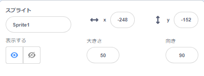
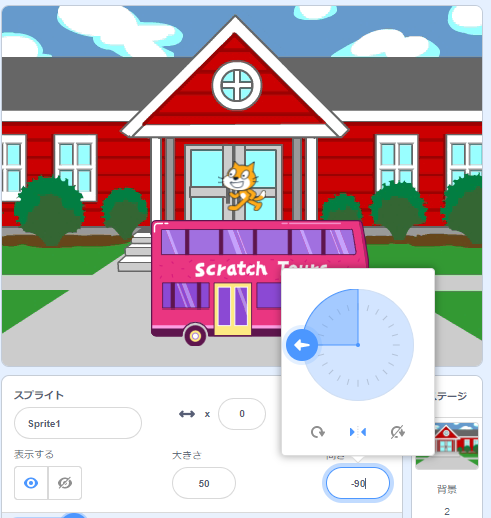

## セットアップ

<div style="display: flex; flex-wrap: wrap">
<div style="flex-basis: 200px; flex-grow: 1; margin-right: 15px;">
あなたはあなたのアニメーションについてのアイディアを持っていますか？ 
  
このステップでは、背景、主人公、そしておもしろいオブジェクトを追加します。 
</div>
<div>  

</div>
</div>

--- task ---

[サプライズを開きます！ アニメーションスタータープロジェクト](https://scratch.mit.edu/projects/582222532/editor){：target = "_ blank"}を開き、使用できるスプライトと背景の範囲を確認します。 主人公やおもしろいオブジェクト、背景についてしばらく考えてみてください。

--- /task ---

--- task ---

**選択：** １つのスプライトが主人公になるように選択し、別のスプライトをおもしろいオブジェクトとして選択します。

![[スプライトを選ぶ] アイコン。](images/add-sprite.png)

--- /task ---

アニメーションをどこで実行しますか？

--- task ---

**選択：** 背景を選択してシーンを設定します。

![[背景を選ぶ] アイコン。](images/add-backdrop.png)

--- /task ---

スプライトをどこから始めたいですか？ どれくらいの大きさにしたいですか？ 彼らをどのように見せたいですか？

--- task ---

`「緑の旗をクリックしたとき」 `{:class="block3events"}ブロックを追加し、アニメーションの開始時のスプライトを設定するためにその下にいくつかブロックを追加してください。

**主人公** と **おもしろいオブジェクト**両方を設定することを忘れないでください。

--- collapse ---
---
title: スプライトを配置します
---

**主人公**のスプライトのプロジェクト全体での位置を変えるには、ステージ上の任意の位置に主人公を移動してください。

**主人公**のスプライトの位置をプロジェクトのある部分に対して変えたい場合は 、ステージ上の任意の位置に主人公を移動し、 `x: y:に行く`{:class="block3motion"}ブロックをあなたのコードに追加してください：

```blocks3
go to x: (0) y: (0) // add the sprite's position
```

**おもしろいオブジェクト**に対してこのタスクを繰り返します。

--- /collapse ---

--- collapse ---
---
title: スプライトのサイズを変更します
---

プロジェクト全体に対してのスプライトのサイズを変更するには、[スプライト] ペインの **サイズ**の数値を変えてください。



スプライトのサイズをプロジェクトの一部に対して変更するには、任意の値にセットした`大きさを◯％にする`{:class="block3looks"}をコードに足してください。 このオプションは、プロジェクト中のスプライトのサイズを変更する場合に適しています。

```blocks3
set size to [100] % // <100 is smaller, >100 is bigger
```

--- /collapse ---

--- collapse ---
---
title: スプライトのコスチュームを設定します
---

プロジェクト全体のスプライトのコスチュームを変更するには、[ **コスチューム**] タブをクリックして、使用可能なコスチュームの1つを選択します。

![[コスチューム] タブ。スプライトに使用できるコスチュームが表示されます。](images/nano-costumes.png)

プロジェクトの一部のスプライトのコスチュームを変更するには、 `コスチュームを◯にする`{：class = "block3looks"}ブロックに追加し、選択したコスチュームを表示するように更新します。

```blocks3
switch costume to [ v]  // update this for your chosen costume
```

プロジェクトの開始時にスプライトを非表示にするには、 `隠す`{:class="block3looks"}ブロックをコードに追加します。

```blocks3
hide 
```

--- /collapse ---

--- collapse ---
---
title: スプライトの方向を設定します
---

スプライトをプロジェクトに追加したときは、スプライトが間違った方向を向いていることがあります。

スプライトの方向をプロジェクト全体に対して変更するには、スプライトペインの **向き** と **回転方法**を変えてください。



スプライトの方向をプロジェクトの一部に対して変更するには、`回転方法`{:class="block3motion"}と `方向`{:class="block3motion"}を変えるためにブロックをコードに追加してください。

```blocks3
set rotation style [left-right v]
point in direction (-90) // turn to the left
```

--- /collapse ---

--- /task ---

--- task ---

プロジェクトを保存(ほぞん)しましょう。

[[[generic-scratch3-saving]]]

--- /task ---

--- save ---
