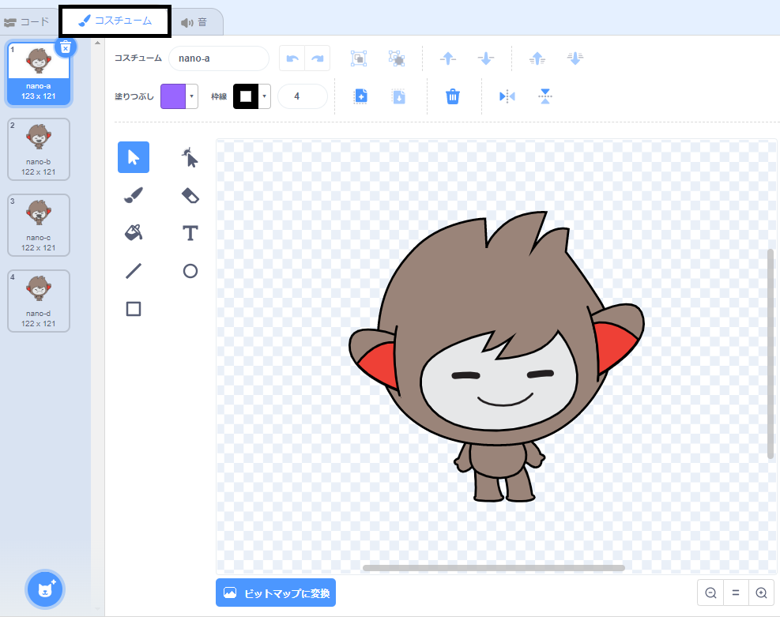

## 場面を作る

アニメーションについてのアイデアはありますか？

背景🖼️、メインキャラクター🐙👩‍🦼🦖、興味をひくオブジェクト🎂🎾🎁を追加して、アニメーションの**はじまり**を作成します。


<p style="border-left: solid; border-width:10px; border-color: #0faeb0; background-color: aliceblue; padding: 10px;">
  <span style="color: #0faeb0">**アニメーション**</span> は、素早く絵を変更することで動きの効果を作ります。 初期のアニメーターは木のブロックに絵を彫り、それをスタンプとして使いました。 Scratchを使ってアニメーションをプログラムする方がはるかに速いです！
</p>

### スタータープロジェクトを開く

--- task ---

[サプライズ！ アニメーションスタータープロジェクト](https://scratch.mit.edu/projects/582222532/editor){:target="_blank"}を開きます。

⏱️ あまり時間がないですか？ [プロジェクト例](https://scratch.mit.edu/studios/29075822){:target="_blank"}のいずれかから始めることができます。

--- /task ---

<p style="border-left: solid; border-width:10px; border-color: #0faeb0; background-color: aliceblue; padding: 10px;">
アプリやビデオゲームの物語を語る<span style="color: #0faeb0">**ナラティブ（物語）デザイナー**</span>と呼ばれる人々がいます。 デジタル物語により、誰もが自分の物語や創作的な想像を他の人と共有できるようになります。
</p>

### 場面をデザインする

--- task ---

**選択:** アニメーションのテーマ。 例えば

+ 🐯 陸の動物
+ 🐠 海の動物
+ 👽 宇宙人
+ 🌿 自然
+ 🌈 天気
+ 🌮 食べ物
+ 🚀 旅行
+ ⚾ スポーツ .... または他の何か

--- /task ---

--- task ---

**選択:** 🐙👩‍🦼🦖**メインキャラクター** となるスプライト、他の🎂🎾🎁**興味をひくオブジェクト**のスプライト、そして場面を決める🖼️**背景**を選択します。


--- /task ---

### スプライトを準備する

スプライトはどの場所から始めたいですか？ どれくらいの大きさにしたいですか？ どのように見せたいですか？

--- task ---

`緑の旗をクリックしたとき`{:class="block3events"}ブロックを追加し、その下にブロックを追加して、アニメーションを始めるときのスプライトを設定してください。

**ヒント:** 🐙👩‍🦼🦖**メインキャラクター** と🎂🎾🎁**興味をひくオブジェクト**の両方のスプライトを設定することを忘れないでください。

--- collapse ---
---
title: スプライトを配置します
---

🐙👩‍🦼🦖**メインキャラクター**をステージ上の任意の位置に移動し、コードに`x座標を～、y座標を～にする`{:class="block3motion"}ブロックを追加します。

```blocks3
go to x: (0) y: (0) // add the sprite's position
```

🎂🎾🎁**興味をひくオブジェクト**に対してこのタスクを繰り返します。

--- /collapse ---

--- collapse ---
---
title: スプライトのサイズを変更します
---

プロジェクト全体のスプライトのサイズを変更するには、スプライトペインの**大きさ**プロパティの数字を変更します。


スプライトのサイズをプロジェクトの一部分で変更するには、好きなサイズの`大きさを～％にする`{:class="block3looks"}コードを追加してください。 このオプションは、プロジェクト内でスプライトのサイズを変更したい場合に適しています。

```blocks3
set size to [100] % // <100 is smaller, >100 is bigger
```

--- /collapse ---

--- collapse ---
---
title: スプライトのコスチュームを設定します
---

プロジェクト全体でスプライトのコスチュームを変更するには、**コスチューム**タブをクリックして、そこにあるコスチュームの1つを選択します。



プロジェクトの一部分でスプライトのコスチュームを変更するには、`コスチュームを～にする`{:class="block3looks"}ブロックを追加して好きなコスチュームを表示します。

```blocks3
switch costume to [ v]  // update this for your chosen costume
```

プロジェクトの開始時にスプライトを非表示にするには、`隠す`{:class="block3looks"}ブロックをコードに追加します。

```blocks3
hide 
```

--- /collapse ---

--- collapse ---
---
title: スプライトの方向を設定します
---

スプライトをプロジェクトに追加したとき、スプライトが間違った方向を向いていることがあります。

スプライトの向きをプロジェクト全体で変更するには、スプライトペインの**向き**と**回転方法**を変えてください。


スプライトの方向をプロジェクトの一部分で変更するには、ブロックをコードに追加して`回転方法`{:class="block3motion"}と`向き`{:class="block3motion"}を変えてください。

```blocks3
set rotation style [left-right v]
point in direction (-90) // turn to the left
```

--- /collapse ---

--- /task ---

--- task ---

プロジェクトを保存します。

[[[generic-scratch3-saving]]]

--- /task ---
