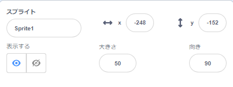
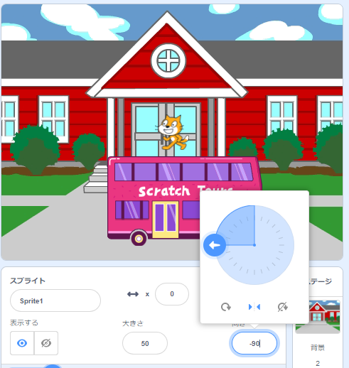

## 場面を作る

あなたはあなたのアニメーションについてのアイディアを持っていますか？ このステップでは、背景、主人公、そしておもしろいオブジェクトを追加します。

**選択：** 背景を選択してシーンを設定します。


<p style="border-left: solid; border-width:10px; border-color: #0faeb0; background-color: aliceblue; padding: 10px;">
  <span style="color: #0faeb0">**アニメーション**</span> は、素早く絵を変更することで動きの効果を作ります。 初期のアニメーターは木のブロックに絵を彫り、それをスタンプとして使いました。 Scratchを使ってアニメーションをプログラムする方がはるかに速いです！
</p>

### スタータープロジェクトを開く

--- task ---

[サプライズ！ アニメーションスタータープロジェクト](https://scratch.mit.edu/projects/582222532/editor){:target="_blank"}を開きます。

⏱️ あまり時間がないですか？ [プロジェクト例](https://scratch.mit.edu/studios/29075822){:target="_blank"}のいずれかから始めることができます。

--- /task ---

<p style="border-left: solid; border-width:10px; border-color: #0faeb0; background-color: aliceblue; padding: 10px;">
アプリやビデオゲームの物語を語る<span style="color: #0faeb0">**ナラティブ（物語）デザイナー**</span>と呼ばれる人々がいます。 デジタル物語により、誰もが自分の物語や創作的な想像を他の人と共有できるようになります。
</p>

### 場面をデザインする

--- task ---

**選択:** アニメーションのテーマ。 例えば

+ 🐯 陸の動物
+ 🐠 海の動物
+ 👽 宇宙人
+ 🌿 自然
+ 🌈 天気
+ 🌮 食べ物
+ 🚀 旅行
+ ⚾ スポーツ .... または他の何か

--- /task ---

--- task ---

**選択：** １つのスプライトが主人公になるように選択し、別のスプライトをおもしろいオブジェクトとして選択します。


--- /task ---

### スプライトを準備する

スプライトはどの場所から始めたいですか？ どれくらいの大きさにしたいですか？ どのように見せたいですか？

--- task ---

`「緑の旗をクリックしたとき」`{:class="block3events"}ブロックを追加し、アニメーションの開始時のスプライトを設定するためにその下にいくつかブロックを追加してください。

**おもしろいオブジェクト**に対してこのタスクを繰り返します。

--- collapse ---
---
title: Position your sprites
---

**主人公**のスプライトの位置をプロジェクトのある部分に対して変えたい場合は 、ステージ上の任意の位置に主人公を移動し、 `x: y:に行く`{:class="block3motion"}ブロックをあなたのコードに追加してください：

```blocks3
go to x: (0) y: (0) // add the sprite's position
```

**主人公** と **おもしろいオブジェクト**両方を設定することを忘れないでください。

--- /collapse ---

--- collapse ---
---
title: Resize your sprites
---

プロジェクト全体に対してのスプライトのサイズを変更するには、[スプライト] ペインの **サイズ**の数値を変えてください。



スプライトのサイズをプロジェクトの一部に対して変更するには、任意の値にセットした`大きさを◯％にする`{:class="block3looks"}をコードに足してください。 このオプションは、プロジェクト中のスプライトのサイズを変更する場合に適しています。 このオプションは、プロジェクト内でスプライトのサイズを変更したい場合に適しています。

```blocks3
set size to [100] % // <100 is smaller, >100 is bigger
```

--- /collapse ---

--- collapse ---
---
title: Set the costumes of your sprites
---

プロジェクト全体のスプライトのコスチュームを変更するには、[ **コスチューム**] タブをクリックして、使用可能なコスチュームの1つを選択します。

![[コスチューム] タブ。スプライトに使用できるコスチュームが表示されます。](images/nano-costumes.png)

プロジェクトの一部のスプライトのコスチュームを変更するには、 `コスチュームを◯にする`{:class="block3looks"}ブロックに追加し、選択したコスチュームを表示するように更新します。

```blocks3
switch costume to [ v]  // update this for your chosen costume
```

プロジェクトの開始時にスプライトを非表示にするには、 `隠す`{:class="block3looks"}ブロックをコードに追加します。

```blocks3
hide 
```

--- /collapse ---

--- collapse ---
---
title: Set the direction of your sprites
---

スプライトをプロジェクトに追加したときは、スプライトが間違った方向を向いていることがあります。

スプライトの方向をプロジェクト全体に対して変更するには、スプライトペインの **向き** と **回転方法**を変えてください。



スプライトの方向をプロジェクトの一部に対して変更するには、`回転方法`{:class="block3motion"}と `方向`{:class="block3motion"}を変えるためにブロックをコードに追加してください。

```blocks3
set rotation style [left-right v]
point in direction (-90) // turn to the left
```

--- /collapse ---

--- /task ---

--- task ---

プロジェクトを保存(ほぞん)しましょう。

[[[generic-scratch3-saving]]]

--- /task ---
