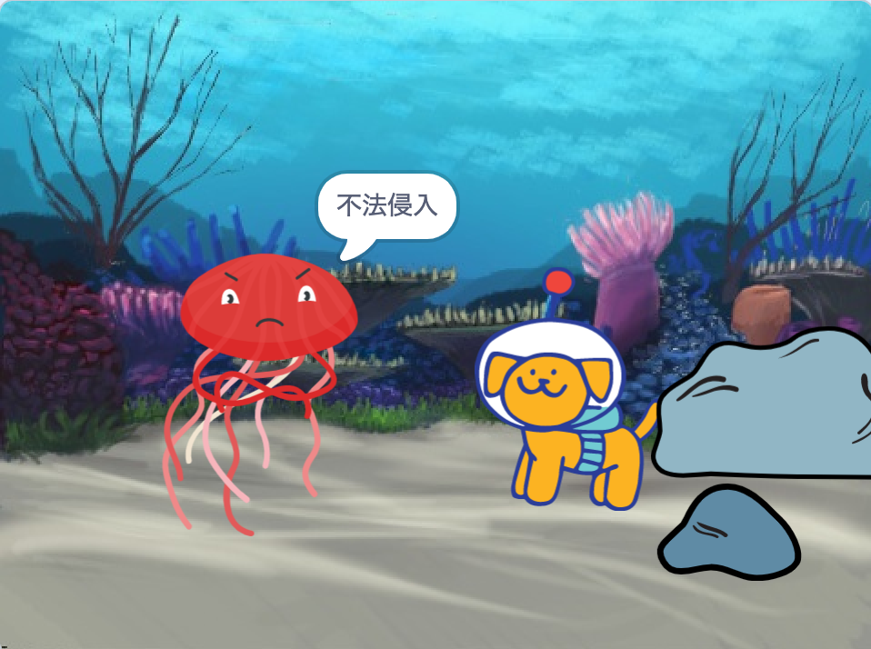

## プロジェクトをアップグレードする

リアクションを追加してプロジェクトをアップグレードできます。 主人公はどのように反応するでしょう？ 

あなたが決めるのです！

--- task ---

何をさせましょうか？ 何か言ったり、音を出したり、コスチュームを変えたり、動いたりさせますか？

[[[scratch3-change-costumes-to-show-mood]]]

[[[scratch3-graphic-effects]]]

[[[scratch3-text-to-speech]]]

[[[scratch3-animate-movement-costumes]]]

[[[scratch3-add-sound]]]

[[[scratch3-record-sound]]]

--- /task ---

--- task ---

例えば
+ 動き、見た目、画像効果を使用して、アニメーションを追加または改善する
+ ペイントエディタでコスチュームを作成または編集して、思い通りの見た目にする
+ 音声を録音したり効果音を録音して、プロジェクトに新しい音を追加します

--- /task ---

プロのプログラマーは、他のプログラマーが作成したコードを探って、そこからインスピレーションを得ます。 

--- task ---

[サプライズアニメーションのスタータープロジェクト](https://scratch.mit.edu/projects/582222532/remixes){:target="_blank"}のリミックスを見て、他のクリエイターが作成した作品を確認してみてください。

--- /task ---

--- task ---

[「サプライズ！ アニメーションの例題」Scratchスタジオ](https://scratch.mit.edu/studios/29075822){:target="_blank"}にある各プロジェクトの**中を見る**リンクを使って、Scratchエディターでプロジェクトを開き、コードを見てアイデアを得たり、プロジェクトがどのように動いているか確認できます。

**ドッペルゲンガー**: [中を見る](https://scratch.mit.edu/projects/500767602/editor){:target="_blank"}

  <iframe allowtransparency="true" width="485" height="402" src="https://scratch.mit.edu/projects/embed/500767602/?autostart=false" frameborder="0"></iframe>

--- /task ---

--- task ---

[「サプライズ！ アニメーションのコミュニティ」Scratchスタジオ](https://scratch.mit.edu/studios/29079784){:target="_blank"}を見て、コミュニティメンバーによって作成されたプロジェクトを確認してください。

--- /task ---

