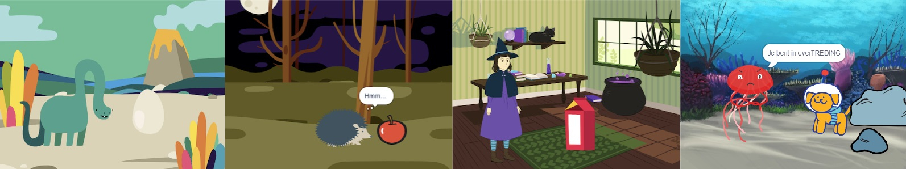

## Je gaat maken

Maak een korte animatie 🎥 met een verrassing 🎉!

Je gaat:

+ Maak je eigen animatie
+ Test en debug je code
+ Bouw je animatie stap voor stap op

--- no-print ---

--- task ---

  

### Afspelen ▶️ 

Klik op de groene vlag om de animatie te bekijken.

De animatie bestaat uit drie delen:
+ Nieuwsgierigheid
+ Verrassing!
+ Reactie

**Dinosaurusverrassing!**: [Bekijk van binnen](https://scratch.mit.edu/projects/595398588/editor){:target="_blank"}

  <iframe allowtransparency="true" width="485" height="402" src="https://scratch.mit.edu/projects/embed/495932563/?autostart=false" frameborder="0"></iframe>

--- /task ---

### Doe inspiratie op 💭

--- task ---

Speel met deze voorbeeldprojecten om ideeën op te doen. Denk na over wat jouw animatie zou kunnen zijn en verken deze voorbeeldprojecten om meer ideeën op te doen:

⭐ Deel je voltooide Verrassing!-animatieproject om kans te maken dat het hier wordt weergegeven.

**BOE!**: [Bekijk van binnen](https://scratch.mit.edu/projects/498655116/editor){:target="_blank"}

  <iframe allowtransparency="true" width="485" height="402" src="https://scratch.mit.edu/projects/embed/498655116/?autostart=false" frameborder="0"></iframe>

**Kattenmagie**: [Bekijk van binnen](https://scratch.mit.edu/projects/498615133/editor){:target="_blank"}

  <iframe allowtransparency="true" width="485" height="402" src="https://scratch.mit.edu/projects/embed/498615133/?autostart=false" frameborder="0"></iframe>

**⭐ Springangst!**: [Bekijk van binnen](https://scratch.mit.edu/projects/720220722/editor){:target="_blank"} (featured community project)

  <iframe allowtransparency="true" width="485" height="402" src="https://scratch.mit.edu/projects/embed/720220722/?autostart=false" frameborder="0"></iframe>

--- /task ---

--- /no-print ---

--- print-only ---

### Doe inspiratie op 💭

Je neemt ontwerpbeslissingen en bedenkt een verhaal voor je animatie met een verrassing. Denk na over wat jouw verhaal zou kunnen zijn, en om meer ideeën op te doen, **Bekijk van binnen** voorbeeldprojecten in de 'Verrassing! animatie — Voorbeelden van Scratch-studio: https://scratch.mit.edu/studios/29075822/

De animatie bestaat uit drie delen:
+ Nieuwsgierigheid
+ Verrassing!
+ Reactie

 

--- /print-only ---

 
