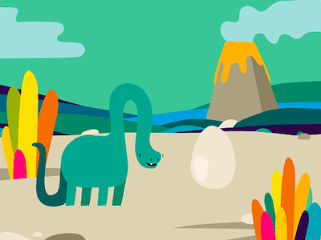
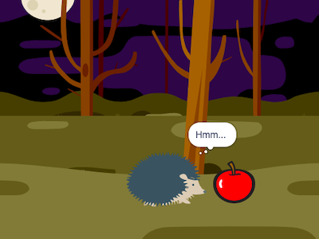

## Inleiding

Maak een korte animatie met een verrassing.

Je gaat:

+ Scratch gebruiken om een animatie te maken
+ Je code testen en fouten oplossen wanneer je wijzigingen aanbrengt
+ Breek een animatie op in delen - dit wordt **decompositie** genoemd - en bouw het deel voor deel op

  **Decompositie** is een project opsplitsen in kleinere en gemakkelijker te begrijpen delen. Dit betekent dat je een project deel voor deel kunt bouwen totdat je het hebt voltooid. 

--- no-print ---

--- task ---

  

### Probeer het 

Klik op de groene vlag om de animatie te bekijken.

De animatie bestaat uit vier delen:
+ Opzetten
+ Nieuwsgierigheid
+ Verrassing!
+ Reactie

**Dinosaurusverrassing!**: [Bekijk van binnen](https://scratch.mit.edu/projects/595398588/editor){:target="_blank"}

  <iframe allowtransparency="true" width="485" height="402" src="https://scratch.mit.edu/projects/embed/595398588/?autostart=false" frameborder="0"></iframe>

--- /task ---

### Doe inspiratie op

--- task ---

Je neemt ontwerpbeslissingen en bedenkt een verhaal voor je animatie met een verrassing.

Denk na over wat jouw verhaal zou kunnen zijn en verken deze voorbeeldprojecten om meer ideeën op te doen:

**BOE!**: [Bekijk van binnen](https://scratch.mit.edu/projects/595399277/editor){:target="_blank"}

  <iframe allowtransparency="true" width="485" height="402" src="https://scratch.mit.edu/projects/embed/595399277/?autostart=false" frameborder="0"></iframe>

**Kattenmagie**: [Bekijk van binnen](https://scratch.mit.edu/projects/595399647/editor){:target="_blank"}

  <iframe allowtransparency="true" width="485" height="402" src="https://scratch.mit.edu/projects/embed/595399647/?autostart=false" frameborder="0"></iframe>

**Overtreder**: [Bekijk van binnen](https://scratch.mit.edu/projects/595400162/editor){:target="_blank"}

  <iframe allowtransparency="true" width="485" height="402" src="https://scratch.mit.edu/projects/embed/595400162/?autostart=false" frameborder="0"></iframe>

--- /task ---

--- /no-print ---

--- print-only ---

### Doe inspiratie op

Je neemt ontwerpbeslissingen en bedenkt een verhaal voor je animatie met een verrassing. Denk na over wat jouw verhaal zou kunnen zijn, en om meer ideeën op te doen, **Bekijk van binnen** voorbeeldprojecten in de 'Verrassing! animatie — Voorbeelden van Scratch-studio: https://scratch.mit.edu/studios/29075822/

De animatie bestaat uit vier delen:
+ Opzetten
+ Nieuwsgierigheid
+ Verrassing!
+ Reactie

   

--- /print-only ---

Er zijn mensen die **verhalende ontwerpers** genoemd worden die verhalen vertellen voor apps en videospellen. Maar met digitaal verhalen vertellen kan iedereen zijn verhalen en creatieve fantasieën met andere mensen delen.

 
