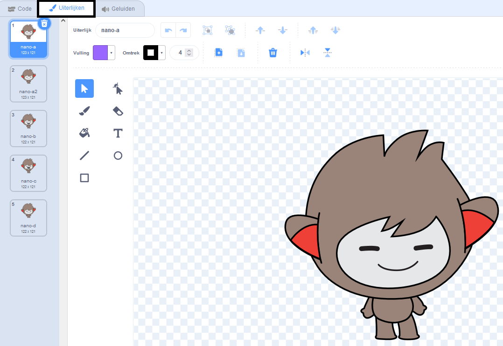
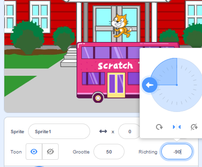

## Creëer je scène

Heb je een idee voor je animatie?

Voeg een achtergrond 🖼️, hoofdpersoon 🐙👩‍🦼🦖 en interessant object 🎂🎾🎁 naar keuze toe om het **eerste deel** van je animatie te maken.


<p style="border-left: solid; border-width:10px; border-color: #0faeb0; background-color: aliceblue; padding: 10px;">
  <span style="color: #0faeb0">**Animatie**</span> creëert het effect van beweging door snel van afbeelding te wisselen. De eerste animators sneden afbeeldingen uit houten blokken en gebruikten ze als stempels. Het is veel sneller om Scratch te gebruiken om je animatie te coderen!
</p>

### Open het startproject

--- task ---

Open het [Verrassing! animatie startproject](https://scratch.mit.edu/projects/582222532/editor){:target="_blank"} en bekijk de reeks sprites en achtergronden die je kunt gebruiken.

⏱️ Niet veel tijd? Je kunt beginnen met een van de [voorbeelden](https://scratch.mit.edu/studios/29075822){:target="_blank"}.

--- /task ---

<p style="border-left: solid; border-width:10px; border-color: #0faeb0; background-color: aliceblue; padding: 10px;">
Er zijn mensen die <span style="color: #0faeb0">**verhalende ontwerpers**</span> genoemd worden die verhalen ontwerpen voor apps en videospellen. Met digitaal verhalen vertellen kan iedereen zijn verhalen en creatieve fantasieën met andere mensen delen.
</p>

### Ontwerp je scène

--- task ---

**Kies:** een thema voor je animatie. Je zou kunnen kiezen:

+ 🐯 Landdieren
+ 🐠 Zeedieren
+ 👽 Buitenaardse wezens
+ 🌿 Natuur
+ 🌈 Weer
+ 🌮 Eten
+ 🚀 Reizen
+ ⚾ Sport .... Of iets anders

--- /task ---

--- task ---

**Kies:** Kies een sprite als hoofdpersoon en een andere sprite als interessant voorwerp.


--- /task ---

### Bereid je sprites voor

Waar wil je dat je sprites beginnen? Hoe groot wil je dat ze zijn? Hoe wil je dat ze eruit zien?

--- task ---

Voeg een `wanneer op de groene vlag wordt geklikt`{:class="block3events"} blok toe, en voeg daaronder blokken toe om je sprites in te stellen aan het begin van je animatie.

**Tip:** Vergeet niet om zowel je 🐙👩‍🦼🦖 **hoofdpersoon** als je 🎂🎾🎁 **interessante object** sprites in te stellen.

--- collapse ---
---
title: Plaats je sprites
---

Verplaats het 🐙👩‍🦼🦖 **hoofdpersoon** naar de positie van jouw keuze in het speelveld en voeg vervolgens een `ga naar x: y:`{:class="block3motion"}-blok toe aan je code:

```blocks3
ga naar x: (0) y: (0) // voeg de positie van de sprite toe
```

Herhaal deze taak voor het 🎂🎾🎁 **interessante object**.

--- /collapse ---

--- collapse ---
---
title: De grootte van je sprites wijzigen
---

Om de grootte van een sprite voor het hele project te wijzigen, wijzig je het getal in de **Grootte**-eigenschap in het Sprite-paneel:


Om de grootte van een sprite voor een deel van het project te wijzigen, voeg je code toe met `maak grootte`{:class="block3looks"} voor de grootte van jouw keuze. Deze optie is goed als je wilt dat je sprite van grootte verandert in het project.

```blocks3
maak grootte [100] % // <100 is smaller, >100 is groter
```

--- /collapse ---

--- collapse ---
---
title: Stel de uiterlijken van je sprites in
---

Om het uiterlijk van een sprite voor het hele project te wijzigen, klik je op de **Uiterlijken** tab en selecteer je een van de beschikbare uiterlijken:



Om het uiterlijk van een sprite voor een deel van het project te wijzigen, voeg je een `verander uiterlijk naar`{:class="block3looks"}-blok toe aan je code en werk je deze bij om het uiterlijk van jouw keuze weer te geven:

```blocks3
verander uiterlijk naar [ v] // werk dit bij voor het door jou gekozen uiterlijk
```

Om een sprite aan het begin van het project te verbergen, voeg je een `verdwijn`{:class="block3looks"}-blok toe aan je code:

```blocks3
verdwijn 
```

--- /collapse ---

--- collapse ---
---
title: Stel de richting van je sprites in
---

Je sprites kunnen de verkeerde kant op kijken wanneer je ze aan je project toevoegt.

Om de richting van een sprite voor het hele project wijzigen, verander de **Richting** en **draaistijl** in het Sprite-paneel:



Om de richting van een sprite voor een deel van het project te wijzigen, voeg je blokken toe aan je code om de `draaistijl`{:class="block3motion"} en `richting`{:class="block3motion"} te wijzigen:

```blocks3
maak draaistijl [links-rechts v]
richt naar (-90) graden // draai naar links
```

--- /collapse ---

--- /task ---

--- task ---

Sla je project op.

[[[generic-scratch3-saving]]]

--- /task ---
