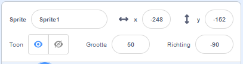

## Opzetten

<div style="display: flex; flex-wrap: wrap">
<div style="flex-basis: 200px; flex-grow: 1; margin-right: 15px;">
Heb je een idee voor je animatie? 
  
In deze stap voeg je een achtergrond, hoofdpersoon en interessant voorwerp toe. 
</div>
<div>  

</div>
</div>

--- task ---

Open het [verrassing! animatie startproject](https://scratch.mit.edu/projects/582222532/editor){:target="_blank"} en bekijk de reeks sprites en achtergronden die je kunt gebruiken. Besteed wat tijd aan het nadenken over je hoofdpersoon, interessant voorwerp en achtergrond.

--- /task ---

--- task ---

**Kies:** Kies een sprite als hoofdpersoon en een andere sprite als interessant voorwerp.


--- /task ---

Waar wil je dat je animatie plaatsvindt?

--- task ---

**Kies:** Kies een achtergrond om de scène in te stellen.


--- /task ---

Waar wil je dat je sprites beginnen? Hoe groot wil je dat ze zijn? Hoe wil je dat ze eruit zien?

--- task ---

Voeg een `wanneer op de groene vlag wordt geklikt`{:class="block3events"} blok toe, en voeg daaronder blokken toe om je sprites in te stellen aan het begin van je animatie.

Vergeet niet om zowel je **hoofdpersoon** als je **interessante voorwerp** in te stellen.

--- collapse ---
---
title: Plaats je sprites
---

Om de positie van de **hoofdpersoon** sprite voor het hele project te wijzigen, verplaats je de hoofdpersoon naar de positie van jouw keuze in het werkgebied.

Om de positie van de **hoofdpersooon** sprite voor een deel van het project te wijzigen, verplaats je de hoofdpersoon naar de positie van jouw keuze in het werkgebied en voeg je een `ga naar x: y:`{:class="block3motion"} blok toe aan je code:

```blocks3
go to x: (0) y: (0) // add the sprite's position
```

Herhaal deze taak voor het **interessante voorwerp**.

--- /collapse ---

--- collapse ---
---
title: De grootte van je sprites wijzigen
---

Om de grootte van een sprite voor het hele project te wijzigen, wijzig je het getal in de **Grootte** in het Sprite-paneel:



Om de grootte van een sprite voor een deel van het project te wijzigen, voeg je code toe om met `maak grootte`{:class="block3looks"} met de grootte van jouw keuze. Deze optie is goed als je wilt dat je sprite van grootte verandert in het project.

```blocks3
set size to [100] % // <100 is smaller, >100 is bigger
```

--- /collapse ---

--- collapse ---
---
title: Stel de uiterlijken van je sprites in
---

Om het uiterlijk van een sprite voor het hele project te wijzigen, klik je op de **Uiterlijken** tab en selecteer je een van de beschikbare uiterlijken:


Om het uiterlijk van een sprite voor een deel van het project te wijzigen, voeg je een `verander uiterlijk naar`{:class="block3looks"}-blok toe aan je code en werk je deze bij om het uiterlijk van jouw keuze weer te geven:

```blocks3
switch costume to [ v]  // update this for your chosen costume
```

Om een sprite aan het begin van het project te verbergen, voeg je een `verdwijn`{:class="block3looks"}-blok toe aan je code:

```blocks3
hide 
```

--- /collapse ---

--- collapse ---
---
title: Stel de richting van je sprites in
---

Je sprites kunnen de verkeerde kant op kijken wanneer je ze aan je project toevoegt.

Om de richting van een sprite voor het hele project wijzigen, verander de **Richting** en **draaistijl** in het Sprite-paneel:


Om de richting van een sprite voor een deel van het project te wijzigen, voeg je blokken toe aan je code om de `draaistijl`{:class="block3motion"} en `richting`{:class="block3motion"} te wijzigen:

```blocks3
set rotation style [left-right v]
point in direction (-90) // turn to the left
```

--- /collapse ---

--- /task ---

--- task ---

Sla je project op.

[[[generic-scratch3-saving]]]

--- /task ---

--- save ---
