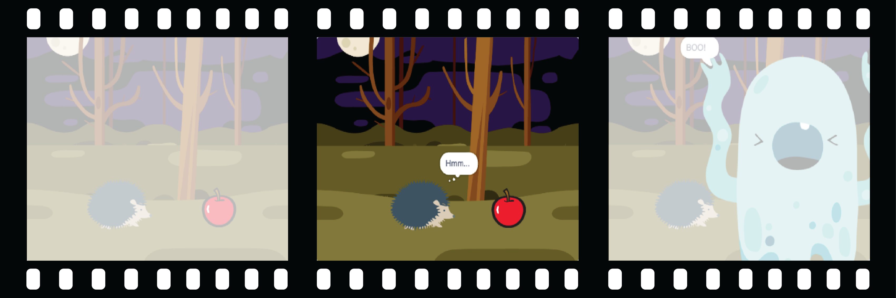

## Toon nieuwsgierigheid

Zal het voorwerp iets doen om de aandacht te trekken? Hoe zal de hoofdpersoon reageren? Jij beslist! Maak het **tweede deel** van je animatie.



<p style="border-left: solid; border-width:10px; border-color: #0faeb0; background-color: aliceblue; padding: 10px;">
  <span style="color: #0faeb0">**Decompositie**</span> is een project opsplitsen in kleinere en gemakkelijker te begrijpen delen. Dit betekent dat je een project stap voor stap kunt bouwen totdat je het hebt voltooid. In deze stap concentreer je je alleen op het nieuwsgierigheidsgedeelte van je animatie.
</p>

### Het voorwerp

--- task ---

**Kies:** Als je wilt dat het 🎂🎾🎁 **interessante object** iets doet om de aandacht te trekken, kies dan wat het object zal doen.


Voeg blokken toe aan het einde van het 🎂🎾🎁 **interessante object**'s `wanneer op de groene vlag werd geklikt`{:class="block3events"} instel-script.

[[[scratch3-jiggle-a-sprite]]]

[[[scratch3-graphic-effects]]]

--- /task ---

### De hoofdpersoon

--- task ---

Laat de 🐙👩‍🦼🦖 **hoofdpersoon** interesse tonen voor het voorwerp. Voeg blokken toe aan het einde van het instel-script van de 🐙👩‍🦼🦖 **hoofdpersoon**.

Als je wilt dat de 🐙👩‍🦼🦖 **hoofdpersoon** wacht totdat het 🎂🎾🎁 **interessante voorwerp** iets heeft gedaan, voeg je een `wacht`{:class="block3control"}-blok toe.


Je zou `zeg`{:class="block3looks"} of `denk`{:class="block3looks"} blokken kunnen gebruiken, of zelfs de `Tekst naar spraak`{:class="block3extensions"} extensie gebruiken om de hoofdpersoon hardop te laten praten!

[[[scratch3-text-to-speech]]]

De hoofdpersoon kan emoties tonen, zoals in het [Ruimtespraak](https://projects.raspberrypi.org/nl-NL/projects/space-talk){:target="_blank"}-project.

[[[scratch3-change-costumes-to-show-mood]]]

De hoofdpersoon kan dapper zijn en dichterbij komen om het voorwerp te bekijken.

[[[scratch3-animate-movement-costumes]]]

--- /task ---

--- task ---

**Test:** Klik op de groene vlag om je project te testen. De 🐙👩‍🦼🦖 **hoofdpersoon** moet nieuwsgierig zijn naar het voorwerp.

Klik nogmaals op de groene vlag. Als je de positie van het 🎂🎾🎁 **interssante voorwerp** of de 🐙👩‍🦼🦖 **hoofdpersoon** sprite hebt gewijzigd, moet je ervoor zorgen dat ze terug worden gezet naar hun startpositie of uiterlijken wanneer je het project opnieuw uitvoert.

--- collapse ---
---
title: Stel de startpositie en uiterlijk in voor een sprite
---

Kies de blokken die je nodig hebt om de positie en uiterlijk aan het begin in te stellen voor een sprite.

```blocks3
when flag clicked // voeg blokken toe om het begin in te stellen 
switch costume to [costume1 v]
set size to (100) % // startgrootte
go to x: (-200) y: (50) // startpositie
richt naar [90] graden
verander [helderheid v] effect met [80]
verschijn
```

**Tip:** Alle grafische effecten worden gewist wanneer je op de groene vlag klikt, dus je hoeft ze niet te wissen, maar je moet mogelijk de effecten instellen die je wilt dat de sprite heeft.

--- /collapse ---

--- /task ---

--- task ---

**Fouten oplossen:**

--- collapse ---
---
title: Het geluid werkt niet
---

Controleer of het volume op jouw computer of tablet luid genoeg is en of jouw luidsprekers of hoofdtelefoons zijn aangesloten en goed werken.

--- /collapse ---

--- collapse ---
---
title: Mijn animatie wordt niet goed opnieuw ingesteld als ik op de groene vlag klik
---

Controleer of je project `wanneer op de groene vlag wordt geklikt`{:class="block3events"}-scripts heeft voor de sprites die ze nodig hebben, en controleer of ze de positie, grootte en uiterlijk van de sprites opnieuw instellen. Voor hulp hierbij, zie de **Stel de startpositie en uiterlijk in voor een sprite** taak hierboven.

--- /collapse ---

--- /task ---

