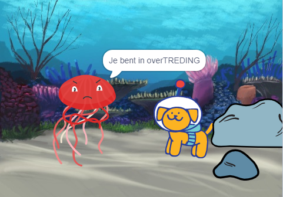

## Verbeter je project

Je kunt je project verbeteen door een reactie toe te voegen. Hoe zal je hoofdpersoon reageren? 

Jij beslist!

--- task ---

Wat zullen ze doen? Zullen ze iets zeggen, een geluid maken, van uiterlijk veranderen of bewegen?

[[[scratch3-change-costumes-to-show-mood]]]

[[[scratch3-graphic-effects]]]

[[[scratch3-text-to-speech]]]

[[[scratch3-animate-movement-costumes]]]

[[[scratch3-add-sound]]]

[[[scratch3-record-sound]]]

--- /task ---

--- task ---

Je zou ook:
+ Je animatie kunnen uitbreiden of verbeteren met beweging, uiterlijken en grafische effecten
+ Uiterlijken kunnen maken of bewerken in de teken-editor om ze eruit te laten zien zoals jij dat wilt
+ Jouw stem of geluidseffecten kunnen opnemen en de nieuwe geluiden toevoegen aan jouw project

--- /task ---

Professionele programmeurs verkennen en halen inspiratie uit code die door andere programmeurs is gemaakt. 

--- task ---

Je kunt ook de remixes bekijken voor het [Verrassing! animatie startproject](https://scratch.mit.edu/projects/582222532/remixes){:target="_blank"} om te zien wat andere makers hebben gemaakt.

--- /task ---

--- task ---

Elk project in de ['Verrassing! animatie — Voorbeelden' Scratch studio](https://scratch.mit.edu/studios/29075822){:target="_blank"} heeft een **Bekijk van binnen** link, die je kunt gebruiken om het project in de Scratch-editor te openen en de code te bekijken om ideeën op te doen en te zien hoe het project werkt.

  <iframe allowtransparency="true" width="485" height="402" src="" frameborder="0"></iframe>

--- /task ---

--- task ---

Kijk dan eens bij onze ['Verrassing! animatie — Community' Scratchstudio](https://scratch.mit.edu/studios/29079784){:target="_blank"} om projecten te zien die zijn gemaakt door communityleden.

--- /task ---

