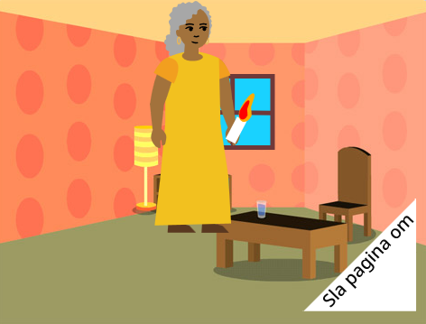

## Wat kun je verder nog doen?

Als je het [Introductie tot Scratch](https://projects.raspberrypi.org/en/pathway/scratch-intro) pad volgt, kun je doorgaan naar het [Ik heb een boek voor je gemaakt](https://projects.raspberrypi.org/en/projects/i-made-you-a-book) project. In dit project maak je een boek in Scratch op basis van je eigen idee.

--- no-print ---

  <iframe allowtransparency="true" width="485" height="402" src="" frameborder="0"></iframe>

--- /no-print ---

--- print-only ---

--- /print-only ---

Wil je nog meer plezier hebben met het verkennen van Scratch, dan kun je één van [deze projecten](https://projects.raspberrypi.org/en/projects?software%5B%5D=scratch&curriculum%5B%5D=%201) proberen.

