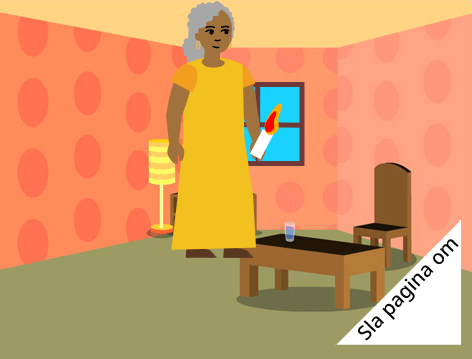

## Wat kun je verder nog doen?

Als je het [Introductie tot Scratch](https://projects.raspberrypi.org/nl-NL/pathway/scratch-intro) pad volgt, kun je doorgaan naar het [Ik heb een boek voor je gemaakt](https://projects.raspberrypi.org/nl-NL/projects/i-made-you-a-book) project. In dit project maak je een boek in Scratch op basis van je eigen idee.

--- no-print ---

**Verlicht de weg naar huis**: [Van binnen bekijken](https://scratch.mit.edu/projects/499860786/editor){:target="_blank"}

  <iframe allowtransparency="true" width="485" height="402" src="https://scratch.mit.edu/projects/embed/499860786/?autostart=false" frameborder="0"></iframe>

--- /no-print ---

--- print-only ---

--- /print-only ---

Wil je nog meer plezier hebben met het verkennen van Scratch, dan kun je één van [deze projecten](https://projects.raspberrypi.org/nl-NL/projects?software%5B%5D=scratch&curriculum%5B%5D=%201) proberen.

***
Dit project werd vertaald door vrijwilligers:

Robert-Jan Kempenaar
Sanneke van der Meer

Dankzij vrijwilligers kunnen we mensen over de hele wereld de kans geven om in hun eigen taal te leren. Jij kunt ons helpen meer mensen te bereiken door vrijwillig te starten met vertalen - meer informatie op [rpf.io/translate](https://rpf.io/translate).
