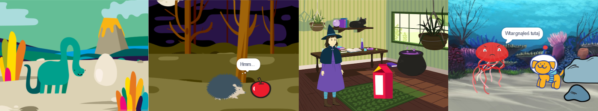

## Co będziesz robić

Stwórz krótką animację 🎥 z fajną niespodzianką 🎉!

Co zrobisz:

+ Stwórz własną animację
+ Przetestuj i debuguj swój kod
+ Twórz animację po jednej części na raz

--- no-print ---

--- task ---

  

### Odtwórz ▶️

Kliknij zieloną flagę, aby obejrzeć animację.

Animacja składa się z trzech części:
+ Ciekawość
+ Niespodzianka!
+ Reakcja

**Niespodzianka dinozaura!**: [Zajrzyj do środka](https://scratch.mit.edu/projects/918507241/editor){:target="_blank"}

  <iframe allowtransparency="true" width="485" height="402" src="https://scratch.mit.edu/projects/embed/918507241/?autostart=false" frameborder="0"></iframe>

--- /task ---

### Zdobądź pomysły 💭

--- task ---

Zapoznaj się z tymi przykładowymi projektami, aby zdobyć więcej pomysłów. Zastanów się, jaka może być Twoja animacja, i zapoznaj się z tymi przykładowymi projektami, aby uzyskać więcej pomysłów:

⭐ Udostępnij swój ukończony projekt animacji Niespodzianka, aby mieć szansę na opublikowanie go tutaj.
**BOO!**: [Zajrzyj do środka](https://scratch.mit.edu/projects/918507854/editor){:target="_blank"}

  <iframe allowtransparency="true" width="485" height="402" src="https://scratch.mit.edu/projects/embed/918507854/?autostart=false" frameborder="0"></iframe>

**Kocia magia**: [Zajrzyj do środka](https://scratch.mit.edu/projects/918508203/editor){:target="_blank"}

  <iframe allowtransparency="true" width="485" height="402" src="https://scratch.mit.edu/projects/embed/918508203/?autostart=false" frameborder="0"></iframe>

**⭐ Jumpscare!**: [Zajrzyj do środka](https://scratch.mit.edu/projects/720220722/editor){:target="_blank"} (wyróżniony projekt społeczności)

  <iframe allowtransparency="true" width="485" height="402" src="https://scratch.mit.edu/projects/embed/720220722/?autostart=false" frameborder="0"></iframe>

--- /task ---

--- /no-print ---

--- print-only ---

### Zdobądź pomysły 💭

Podejmiesz decyzje projektowe i wymyślisz historię do swojej animacji z niespodzianką. Zastanów się, jaka może być Twoja historia i aby uzyskać więcej pomysłów, **Zajrzyj do środka** przykładowych projektów w sekcji „Niespodzianka! animacja — Przykłady Scratch studio: https://scratch.mit.edu/studios/29075822/

Animacja składa się z trzech części:
+ Ciekawość
+ Niespodzianka!
+ Reakcja

--- /print-only ---

 
