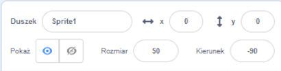
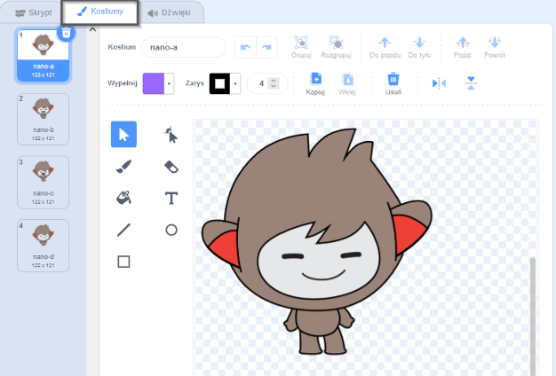
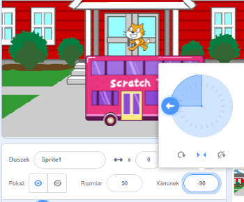

## Stwórz swoją scenę

Masz pomysł na swoją animację?

Dodaj tło 🖼️, głównego bohatera 🐙👩‍🦼🦖 i interesujący obiekt 🎂🎾🎁, aby stworzyć**pierwszą część** twojej animacji.


<p style="border-left: solid; border-width:10px; border-color: #0faeb0; background-color: aliceblue; padding: 10px;">
  <span style="color: #0faeb0">**Animacja**</span> tworzy efekt ruchu, szybko zmieniając zdjęcia. Pierwsi animatorzy rzeźbili obrazy z drewnianych klocków i używali ich jako pieczątek. Kodowanie animacji za pomocą Scratcha jest znacznie szybsze!
</p>

### Otwórz projekt startowy

--- task ---

Otwórz [Niespodziankę! projekt startowy animacji](https://scratch.mit.edu/projects/582222532/editor){:target="_blank"}.

⏱️ Mało czasu? Możesz zacząć od jednego z [przykładów](https://scratch.mit.edu/studios/29075822){:target="_blank"}.

--- /task ---

<p style="border-left: solid; border-width:10px; border-color: #0faeb0; background-color: aliceblue; padding: 10px;">
Niektóre osoby nazywane <span style="color: #0faeb0">**projektantami narracji**</span> zajmują się opowiadaniem historii w aplikacjach i grach wideo. Cyfrowe opowiadanie historii pozwala każdemu dzielić się swoimi historiami i kreatywnymi wyobrażeniami z innymi ludźmi.
</p>

### Zaprojektuj swoją scenę

--- task ---

**Wybierz:** temat dla swojej animacji. Możesz wybrać:

+ 🐯 Zwierzęta lądowe
+ 🐠 Zwierzęta morskie
+ 👽 Kosmici
+ 🌿 Natura
+ 🌈 Pogoda
+ 🌮 Jedzenie
+ 🚀 Podróże
+ ⚾ Sport
.... Albo coś innego

--- /task ---

--- task ---

**Wybierz:** Wybierz duszka, który będzie 🐙👩‍🦼🦖 **głównym bohaterem**, innego duszka 🎂🎾🎁 **interesującym obiektem** i 🖼️ **tłem**, aby ustawić scenę.


--- /task ---

### Przygotuj duszki

Gdzie Twoje duszki mają zaczynać? Jak duże mają być? Jak chcesz, żeby wyglądały?

--- task ---

Dodaj blok{:class="block3events"}`kiedy kliknięto flagę`, a następnie poniżej dodaj bloki, aby ustawić swoje duszki na początku animacji.

**Wskazówka:** Pamiętaj, aby ustawić zarówno swojego 🐙👩‍🦼🦖 **głównego bohatera**, jak i swojego 🎂🎾🎁 **interesujący obiekt** duszki.

--- collapse ---
---
title: Ustaw swoje duszki
---

Przesuń 🐙👩‍🦼🦖 **głównego bohatera** w wybrane miejsce na scenie, a następnie dodaj blok `go to x: y:`{:class="block3motion"} do swojego kodu:

```blocks3
go to x: (0) y: (0) // dodaj pozycję duszka
```

Powtórz to zadanie dla **interesującego obiektu**.

--- /collapse ---

--- collapse ---
---
title: Zmień rozmiar swoich duszków
---

Aby zmienić rozmiar duszka dla całego projektu, zmień liczbę we właściwościach**Rozmiar** w kafelku duszka:



Aby zmienić rozmiar duszka dla części projektu, dodaj kod na `ustaw rozmiar na`{:class="block3looks"} wybrany przez Ciebie rozmiar. Ta opcja jest dobra, jeśli chcesz, aby twój duszek zmienił rozmiar w projekcie.

```blocks3
set size to [100] % // <100 jest mniejsze, >100 jest większe
```

--- /collapse ---

--- collapse ---
---
title: Ustaw kostiumy swoich duszków
---

Aby zmienić kostium duszka dla całego projektu, kliknij **Kostiumy** i wybierz jeden z dostępnych kostiumów:



Aby zmienić kostium duszka dla części projektu, dodaj blok `zmień kostium na`{:class="block3looks"} w swoim kodzie i zaktualizuj go, aby wyświetlał wybrany kostium:

```blocks3
switch costume to [ v]  // zaktualizuj to dla wybranego stroju
```

Aby ukryć duszka na początku projektu, dodaj do swojego kodu blok `ukryj`{:class="block3looks"}:

```blocks3
hide 
```

--- /collapse ---

--- collapse ---
---
title: Ustaw kierunek swoich duszków
---

Twoje duszki mogą być skierowane w złą stronę, gdy dodasz je do swojego projektu.

Aby zmienić kierunek duszka dla całego projektu, zmień **Kierunek** i **styl obrotu** w panelu duszka:



Aby zmienić kierunek duszka dla części projektu, dodaj bloki do kodu, aby zmienić `styl obrotu`{:class="block3motion"} i `kierunek`{:class="block3motion"}:

```blocks3
set rotation style [lewo-prawo v]
point in direction (-90) // obróć w lewo
```

--- /collapse ---

--- /task ---

--- task ---

Zapisz swój projekt.

[[[generic-scratch3-saving]]]

--- /task ---
