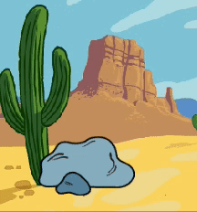
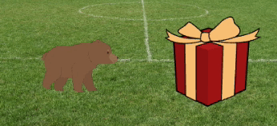

## Okazuj ciekawość

Czy przedmiot zrobi coś, co przyciągnie uwagę? Jak zareaguje postać? Ty decydujesz! Utwórz **drugą część** swojej animacji.


<p style="border-left: solid; border-width:10px; border-color: #0faeb0; background-color: aliceblue; padding: 10px;">
  <span style="color: #0faeb0">**Dekompozycja**</span> to rozbicie projektu na mniejsze i łatwiejsze do zrozumienia części. Oznacza to, że możesz budować części projektu po kolei, dopóki go nie ukończysz. W tym kroku skupisz się tylko na ciekawej części animacji.
</p>

### Obiekt

--- task ---

**Wybierz:** Jeśli chcesz, aby 🎂🎾🎁 **interesujący obiekt** zrobił coś, co przyciągnie uwagę, wybierz, co zrobi ten przedmiot.



Dodaj bloki na końcu 🎂🎾🎁 **interesujących obiektów** `kiedy kliknięto zieloną flagę`{:class="block3events"} skryptu instalacyjnego.

[[[scratch3-jiggle-a-sprite]]]

[[[scratch3-graphic-effects]]]

--- /task ---

### Bohater

--- task ---

Zdobądź 🐙👩‍🦼🦖 **głównego bohatera**, aby okazać zainteresowanie przedmiotem. Dodaj bloki na końcu skryptu konfiguracyjnego 🐙👩‍🦼🦖 **głównego bohatera**.

Jeśli potrzebujesz, aby 🐙👩‍🦼🦖 **główny bohater** poczekał, aż 🎂🎾🎁 **interesujący obiekt** coś zrobi, dodaj blok `czekać`{:class="block3control"}.



Możesz użyć bloków `powiedz`{:class="block3looks"} lub `pomyśl`{:class="block3looks"}, a nawet użyj `rozszerzenia Tekst do Mowy`{:class="block3extensions"}, aby sprawić by bohater przemówił!

[[[scratch3-text-to-speech]]]

Postać może pokazywać emotki, jak w projekcie [Kosmiczna rozmowa](https://projects.raspberrypi.org/en/projects/space-talk){:target="_blank"}.

[[[scratch3-change-costumes-to-show-mood]]]

Postać może być odważna i podejść bliżej, aby sprawdzić obiekt.

[[[scratch3-animate-movement-costumes]]]

--- /task ---

--- task ---

**Test:** Kliknij zieloną flagę, aby przetestować swój projekt. 🐙👩‍🦼🦖 **Główny bohater** powinien okazywać ciekawość obiektu.

Ponownie kliknij zieloną flagę. Jeśli zmieniłeś 🎂🎾🎁 **interesujący obiekt** lub 🐙👩‍🦼🦖 **głównego bohatera** pozycję lub wygląd duszka, będziesz musiał upewnić się, że po ponownym uruchomieniu projektu zostaną one ustawione z powrotem w początkowej pozycji lub wyglądzie.

--- collapse ---
---
title: Ustaw pozycję startową i wygląd duszka
---

Wybierz bloki, których potrzebujesz, aby ustawić pozycję i wygląd duszka na początku.

```blocks3
when flag clicked // add blocks to set up the start 
switch costume to [costume1 v]
set size to (100) % // starting size
go to x: (-200) y: (50) // starting position
point in direction [90]
set [brightness v] effect to [80]
show
```

**Wskazówka:** Wszystkie efekty graficzne są usuwane po kliknięciu zielonej flagi, więc nie musisz ich czyścić, ale może być konieczne ustawienie efektów, które chcesz, aby duszek miał.

--- /collapse ---

--- /task ---

--- task ---

**Debugowanie:**

--- collapse ---
---
title: Dźwięk nie działa
---

Sprawdź, czy głośność na komputerze lub tablecie jest wystarczająca, a głośniki lub słuchawki są podłączone i działają prawidłowo.

--- /collapse ---

--- collapse ---
---
title: Moja animacja nie resetuje się poprawnie po kliknięciu zielonej flagi
---

Sprawdź, czy projekt ma skrypt `kiedy kliknięto zieloną flagę`{class = „block3events”} dla duszków, które tego potrzebują, i sprawdź, czy przywracają duszkom ich położenie, rozmiar i wygląd. Aby uzyskać pomoc, zobacz **Ustaw pozycję początkową i wygląd duszków** powyżej.

--- /collapse ---

--- /task ---

