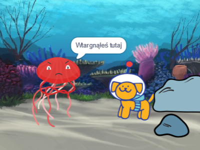

## Ulepsz swój projekt

Możesz ulepszyć swój projekt, dodając reakcję. Jak zareaguje główny bohater? 

Ty decydujesz!

--- task ---

Co zrobi? Czy coś powie, wyda dźwięk, zmieni kostiumy, poruszy się?

[[[scratch3-change-costumes-to-show-mood]]]

[[[scratch3-graphic-effects]]]

[[[scratch3-text-to-speech]]]

[[[scratch3-animate-movement-costumes]]]

[[[scratch3-add-sound]]]

[[[scratch3-record-sound]]]

--- /task ---

--- task ---

Możesz także:
+ Dodać lub ulepszyć animację za pomocą ruchu, wyglądu lub efektów graficznych
+ Tworzyć lub edytować kostiumy w edytorze Maluj, aby wyglądały tak, jak chcesz
+ Nagrać swój głos lub efekty dźwiękowe i dodaj nowe dźwięki do swojego projektu

--- /task ---

Profesjonalni programiści badają i czerpią inspirację z kodu stworzonego przez innych programistów. 

--- task ---

Możesz też przejrzeć remiksy dla pierwszego projektu animacji [Surprise](https://scratch.mit.edu/projects/582222532/remixes){:target="_blank"}, aby zobaczyć, co stworzyli inni twórcy.

--- /task ---

--- task ---

Każdy projekt w kategorii ['Animacja! niespodzianka! — Przykłady' w Scratch studio](https://scratch.mit.edu/studios/29075822){:target="_blank"} ma **Zajrzyj do środka**, za pomocą którego możesz otworzyć projekt w edytorze Scratch i spojrzeć na kod, aby uzyskać pomysły i zobaczyć, jak projekt działa.

  <iframe allowtransparency="true" width="485" height="402" src="" frameborder="0"></iframe>

--- /task ---

--- task ---

Spójrz na naszą ['Animację! niespodziankę! — ze społeczności Scratch studio](https://scratch.mit.edu/studios/29079784){:target="_blank"}, aby zobaczyć projekty stworzone przez członków społeczności.

--- /task ---

