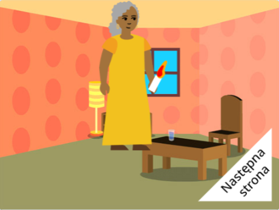

## Co dalej?

Jeśli podążasz ścieżką [Wprowadzenie do Scratch](https://projects.raspberrypi.org/pl-PL/pathway/scratch-intro), możesz przejść do projektu [Zrobiłem dla Ciebie książkę](https://projects.raspberrypi.org/pl-PL/projects/i-made-you-a-book). W tym projekcie zrobisz książkę w Scratchu według własnego pomysłu.

--- no-print ---

**Oświetl drogę do domu**: [Zajrzyj do środka](https://scratch.mit.edu/projects/499860786/editor){:target="_blank"}

  <iframe allowtransparency="true" width="485" height="402" src="https://scratch.mit.edu/projects/embed/499860786/?autostart=false" frameborder="0"></iframe>

--- /no-print ---

--- print-only ---

--- /print-only ---

Jeśli chcesz mieć więcej zabawy podczas odkrywania Scratch, możesz wypróbować dowolny z [tych projektów](https://projects.raspberrypi.org/pl-PL/projects?software%5B%5D=scratch&curriculum%5B%5D=%201).

***

Ten projekt został przetłumaczony przez wolontariuszy:

Paweł Wilk
Krzysztof Nowak
Szymon Olesiński
Aleksandra Musialkiewicz

Dzięki wolontariuszom możemy dać ludziom na całym świecie szansę nauki w ich własnym języku. Możesz pomóc nam dotrzeć do większej liczby osób, zgłaszając się na ochotnika do tłumaczenia - więcej informacji na stronie [rpf.io/translate](https://rpf.io/translate).

