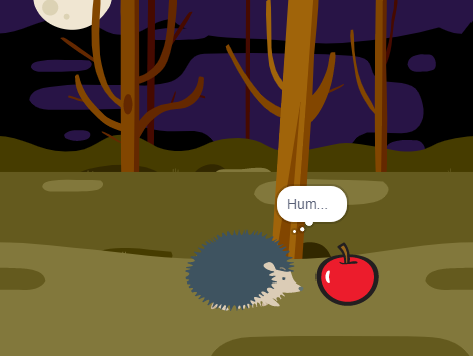
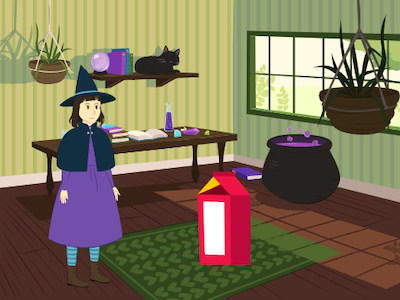

## Introdução

Crie uma curta animação com uma surpresa.

Você vai:

+ Usar Scratch para criar uma animação
+ Testar e depurar seu código ao fazer alterações
+ Dividir uma animação em partes - isso é chamado de **decomposição** - e construir uma parte de cada vez

  ** Decomposição ** é quebrar um projeto em partes que são menores e mais fáceis de entender. Isso significa que você pode construir um projeto, uma parte de cada vez, até concluí-lo. 

--- no-print ---

--- task ---

  

### Experimente 

Clique na bandeira verde para assistir à animação.

A animação tem quatro partes:
+ Configuração
+ Curiosidade
+ Surpresa!
+ Reação

** Surpresa de dinossauro! **: [Veja dentro de] (https://scratch.mit.edu/projects/495932563/editor) {: target = "_blank"}

  <iframe allowtransparency="true" width="485" height="402" src="https://scratch.mit.edu/projects/embed/495932563/?autostart=false" frameborder="0"></iframe>

--- /task ---

### Inspire-se

--- task ---

Você tomará decisões de design e pensará em uma história para sua animação com uma surpresa.

Pense em como pode ser sua história e explore estes projetos de exemplo para obter mais ideias:

**BOO!**: [Veja dentro de](https://scratch.mit.edu/projects/498655116/editor){: target = "_ blank"}

  <iframe allowtransparency="true" width="485" height="402" src="https://scratch.mit.edu/projects/embed/498655116/?autostart=false" frameborder="0"></iframe>

**Gato mágico**: [Veja dentro de](https://scratch.mit.edu/projects/498615133/editor){: target = "_ blank"}

  <iframe allowtransparency="true" width="485" height="402" src="https://scratch.mit.edu/projects/embed/498615133/?autostart=false" frameborder="0"></iframe>

**Invasor**: [Veja dentro de](https://scratch.mit.edu/projects/498616008/editor){: target = "_ blank"}

  <iframe allowtransparency="true" width="485" height="402" src="https://scratch.mit.edu/projects/embed/498616008/?autostart=false" frameborder="0"></iframe>

--- /task ---

--- /no-print ---

--- print-only ---

### Inspire-se

Você tomará decisões de design e pensará em uma história para sua animação com uma surpresa. Pense em como pode ser sua história e, para ter mais ideias, **Veja em** projeto de exemplo na seção 'Surpresa! animação - Estúdio Scratch de exemplos: https://scratch.mit.edu/studios/29075822/

A animação tem quatro partes:
+ Configurar
+ Curiosidade
+ Surpresa!
+ Reação

   

--- /print-only ---

Existem pessoas chamadas ** designers de narrativa ** que fazem histórias para aplicativos e videogames. Mas a narrativa digital permite que todos compartilhem suas histórias e imaginações criativas com outras pessoas.

 
