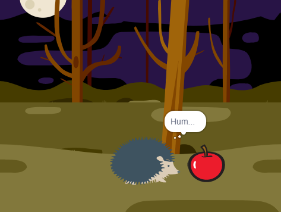

## Você vai fazer

Crie uma curta animação com uma surpresa.

Você vai:

+ Usar Scratch para criar uma animação
+ Testar e depurar seu código ao fazer alterações
+ Dividir uma animação em partes - isso é chamado de **decomposição** - e construir uma parte de cada vez

--- no-print ---

--- task ---

  

### Experimente 

Clique na bandeira verde para assistir à animação.

A animação tem quatro partes:
+ Configuração
+ Curiosidade
+ Surpresa!
+ Reação

**Surpresa de dinossauro!**: [Veja dentro de](https://scratch.mit.edu/projects/667601685/editor){:target="_blank"}

  <iframe allowtransparency="true" width="485" height="402" src="https://scratch.mit.edu/projects/embed/495932563/?autostart=false" frameborder="0"></iframe>

--- /task ---

### Tenha ideias 💭

--- task ---

Brinque com estes projetos de exemplo para ter ideias. Pense em como pode ser sua história e explore estes projetos de exemplo para obter mais ideias:

⭐ Compartilhe o seu projeto de animação "Surpresa", para ter a oportunidade dele ser apresentado aqui.

**Invasor**: [Veja dentro de](https://scratch.mit.edu/projects/667587533/editor){:target="_blank"}

  <iframe allowtransparency="true" width="485" height="402" src="https://scratch.mit.edu/projects/embed/498655116/?autostart=false" frameborder="0"></iframe>

**BOO!**: [Veja dentro de](https://scratch.mit.edu/projects/667602135/editor){:target="_blank"}

  <iframe allowtransparency="true" width="485" height="402" src="https://scratch.mit.edu/projects/embed/498615133/?autostart=false" frameborder="0"></iframe>

**Gato mágico**: [Veja dentro de](https://scratch.mit.edu/projects/667601884/editor){:target="_blank"}

  <iframe allowtransparency="true" width="485" height="402" src="https://scratch.mit.edu/projects/embed/720220722/?autostart=false" frameborder="0"></iframe>

--- /task ---

--- /no-print ---

--- print-only ---

### Tenha ideias 💭

Você tomará decisões de design e pensará em uma história para sua animação com uma surpresa. Pense em como pode ser sua história e, para ter mais ideias, **Veja em** projeto de exemplo na seção 'Surpresa! animação - Estúdio Scratch de exemplos: https://scratch.mit.edu/studios/29075822/

A animação tem quatro partes:
+ Curiosidade
+ Surpresa!
+ Reação

 

--- /print-only ---

 
