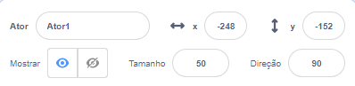
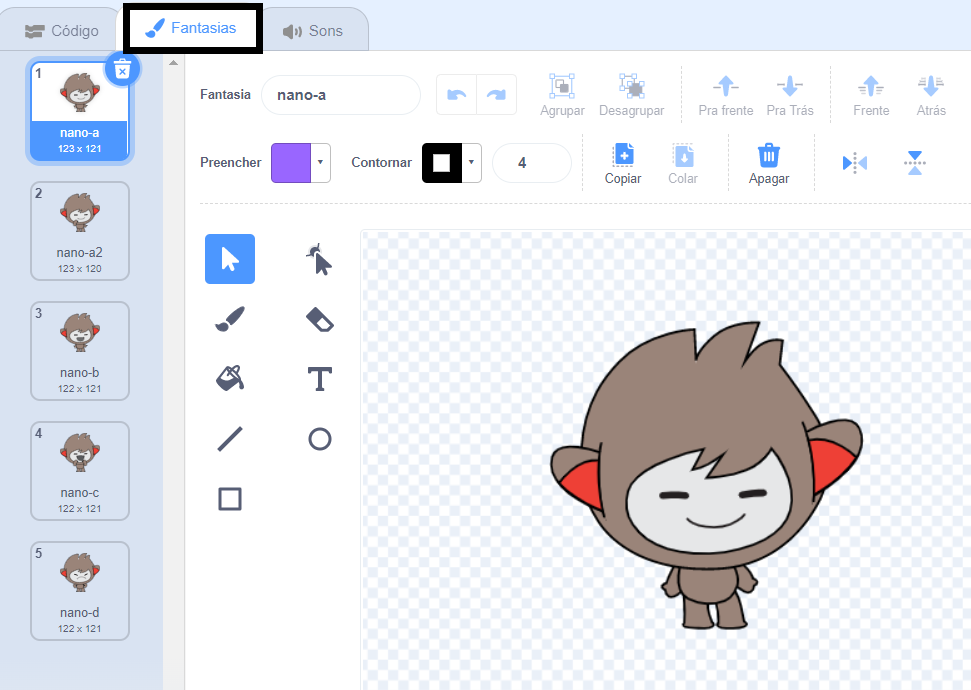
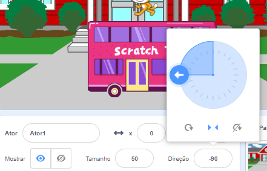

## Configurar

<div style="display: flex; flex-wrap: wrap">
<div style="flex-basis: 200px; flex-grow: 1; margin-right: 15px;">
Você tem uma ideia sobre a sua animação? 
  
Nesta etapa, você adicionará um cenário, personagem principal e objeto interessante. 
</div>
<div>  

</div>
</div>

--- task ---

Abra um  [projeto inicial de Surpresa! animação](https://scratch.mit.edu/projects/582222532/editor){:target="_blank"} e observe a gama de atores e cenários que você pode usar. Passe algum tempo pensando sobre seu personagem principal, objeto interessante e cenário.

--- /task ---

--- task ---

**Escolha:** Escolha um ator para ser o personagem principal e outro para ser o objeto de interesse.


--- /task ---

Onde você quer que sua animação aconteça?

--- task ---

**Escolha:** Escolha um cenário para definir a cena.


--- /task ---

Onde você quer que seus atores comecem? Quão grande você quer que eles sejam? Como você quer que eles pareçam?

--- task ---

Adicione um `quando a bandeira verde clicar em`bloco{:class="block3events"} e, abaixo, adicione blocos para configurar seus atores no início da animação.

Lembre-se de configurar seu **personagem principal** e seus **objetos interessantes**.

--- collapse ---
---
title: Posicione seus atores
---

Para alterar a posição do **personagem principal** para todo o projeto, mova o personagem principal para a posição de sua escolha no Palco.

Para alterar a posição do **personagem principal** ator para parte do projeto, mova o personagem principal para a posição de sua escolha no Palco, em seguida, adicione `vá para x: y:`{:class="block3motion"} para bloquear para o seu código:

```blocks3
go to x: (0) y: (0) // adicione a posição do ator
```

Repita esta tarefa para o **objeto de interesse**.

--- /collapse ---

--- collapse ---
---
title: Redimensione seus atores
---

Para alterar o tamanho de um ator para todo o projeto, altere o número em**Tamanho** no painel do ator:



Para alterar o tamanho de um ator para parte do projeto, adicione o código para `defina o tamanho para`{:class="block3looks"} o tamanho de sua escolha. Esta opção é boa se você quiser que seu sprite mude de tamanho no projeto.

```blocks3
set size to [100] % // <100 é menor,> 100 é maior
```

--- /collapse ---

--- collapse ---
---
title: Defina as roupas de seus atores
---

Para trocar a fantasia de um ator em todo o projeto, clique em **Fantasias** e selecione uma das fantasias disponíveis:



Para trocar a fantasia de um ator em parte do projeto, adicione um bloco `troca de fantasia`{:class="block3looks"} em seu código e atualize-o para mostrar a fantasia de sua escolha:

```blocks3
switch costume to [ v]  // atualize isso para o seu traje escolhido
```

Para ocultar um ator no início do projeto, adicione um bloco `esconda`{:class="block3looks"} ao seu código:

```blocks3
hide 
```

--- /collapse ---

--- collapse ---
---
title: Defina a direção de seus atores
---

Seus atores podem estar voltados para o lado errado quando você os adiciona ao seu projeto.

Para alterar a direção de um ator para todo o projeto, altere o **estilo de rotação** e **Direção** no painel atores:



Para alterar a direção de um ator para parte do projeto, adicione blocos ao seu código para alterar o `estilo de rotação`{:class="block3motion"} e `direção`{:class="block3motion"}:

```blocks3
set rotation style [left-right v]
point in direction (-90) // vire à esquerda
```

--- /collapse ---

--- /task ---

--- task ---

Salve o seu projeto.

[[[generic-scratch3-saving]]]

--- /task ---

--- save ---
