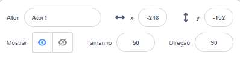
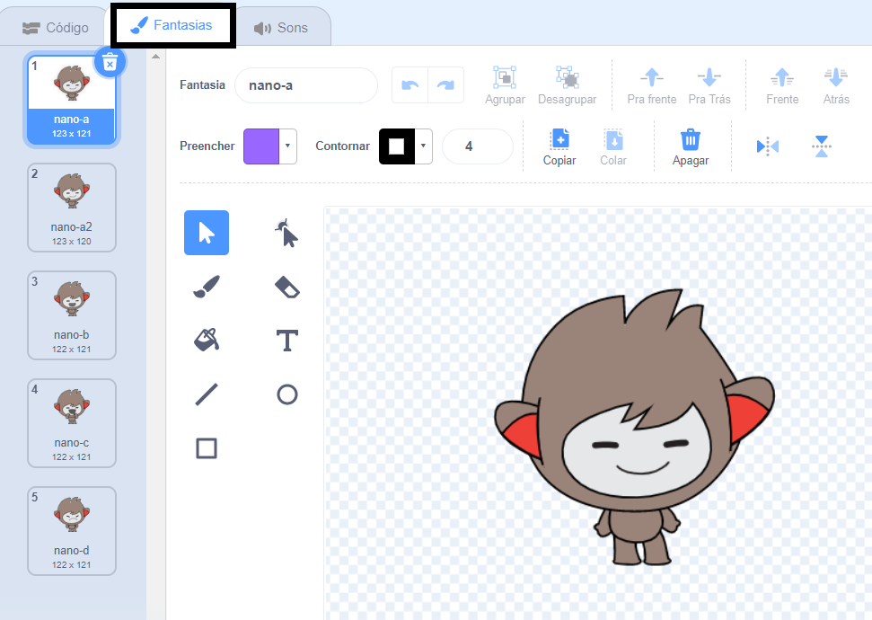
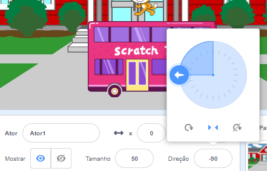

## Crie seu cenário

Você tem uma ideia sobre a sua animação?

Adicione um cenário 🖼️, personagem principal 🐙👩‍🦼🦖 e um objeto interessante 🎂🎾🎁 de sua escolha para criar a **primeira parte** de sua animação.


<p style="border-left: solid; border-width:10px; border-color: #0faeb0; background-color: aliceblue; padding: 10px;">
  <span style="color: #0faeb0">**Animação**</span> cria o efeito de movimento mudando as imagens rapidamente. Os primeiros animadores esculpiam desenhos em blocos de madeira e as usavam como carimbos. É muito mais rápido usar o Scratch para codificar sua animação!
</p>

### Abra o projeto inicial do Scratch

--- task ---

Abra o projeto inicial de animação, [ Surpresa!](https://scratch.mit.edu/projects/582222532/editor){:target="_blank"}.

⏱️ Sem muito tempo? Você pode começar a partir de um dos

exemplos<0>{:target="_blank"}. </p> 

--- /task ---

<p style="border-left: solid; border-width:10px; border-color: #0faeb0; background-color: aliceblue; padding: 10px;">
Existem pessoas chamadas <span style="color: #0faeb0">**designers de narrativa**</span> que criam histórias para aplicativos e vídeogames. A narrativa digital permite que todos compartilhem suas histórias e imaginações criativas com outras pessoas.
</p>

### Projete seu cenário

--- task ---

**Escolha:** um tema para sua animação. Você pode escolher:

+ 🐯 Animais Terrestres
+ 🐠 Animais marinhos
+ 👽 Alienígenas
+ 🌿 Natureza
+ 🌈 Clima
+ 🌮 Comida
+ 🚀 Viagem
+ ⚾ Esporte .... Ou alguma outra coisa

--- /task ---

--- task ---

**Escolha:** Escolha um ator para ser o 🐙👩‍🦼🦖 **personagem principal**, outro ator para ser o 🎂🎾🎁 **interessante objeto** e um 🖼️ **pano de fundo** para definir o cenário. 


--- /task ---


### Prepare seus atores

Onde você quer que seus atores comecem? Quão grande você quer que eles sejam? Como você quer que eles pareçam?

--- task ---

Adicione um `quando a bandeira verde clicar em`{:class="block3events"} bloco e, abaixo, adicione blocos para configurar seus atores no início da animação. 

Repita esta tarefa para o **objeto de interesse**.

--- collapse ---


---


title: Position your sprites
---

Para alterar a posição do **personagem principal** ator para parte do projeto, mova o personagem principal para a posição de sua escolha no Palco, em seguida, adicione `vá para x: y:`{:class="block3motion"} para bloquear para o seu código:


```blocks3
go to x: (0) y: (0) // add the sprite's position
```


Lembre-se de configurar seu **personagem principal** e seus **objetos interessantes**. 

--- /collapse ---

--- collapse ---


---


title: Redimensione seus atores
---

Para alterar o tamanho de um ator para todo o projeto, altere o número em **Tamanho** no painel do ator:



Para alterar o tamanho de um ator para parte do projeto, adicione o código para `defina o tamanho para`{:class="block3looks"} o tamanho de sua escolha. Esta opção é boa se você quiser que seu sprite mude de tamanho no projeto. 


```blocks3
set size to [100] % // <100 is smaller, >100 is bigger
```


--- /collapse ---

--- collapse ---


---


title: Set the costumes of your sprites
---

Para trocar a fantasia de um ator em todo o projeto, clique em **Fantasias** e selecione uma das fantasias disponíveis:



Para trocar a fantasia de um ator em parte do projeto, adicione um bloco `troca de fantasia`{:class="block3looks"} em seu código e atualize-o para mostrar a fantasia de sua escolha:


```blocks3
switch costume to [ v]  // update this for your chosen costume
```


Para ocultar um ator no início do projeto, adicione um bloco `esconda`{:class="block3looks"} ao seu código:


```blocks3
hide 
```


--- /collapse ---

--- collapse ---


---


title: Set the direction of your sprites
---

Seus atores podem estar voltados para o lado errado quando você os adiciona ao seu projeto. 

Para alterar a direção de um ator para todo o projeto, altere o **estilo de rotação** e **Direção** no painel atores:



Para alterar a direção de um ator para parte do projeto, adicione blocos ao seu código para alterar o `estilo de rotação`{:class="block3motion"} e `direção`{:class="block3motion"}:


```blocks3
set rotation style [left-right v]
point in direction (-90) // turn to the left
```


--- /collapse ---

--- /task ---

--- task ---

Salve o seu projeto.

[[[generic-scratch3-saving]]]

--- /task ---
