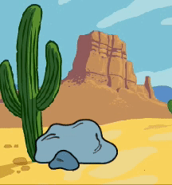
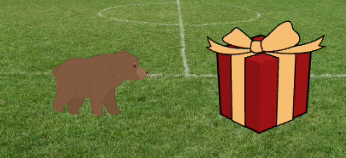

## Mostre curiosidade

O objeto fará algo para atrair a atenção? Como o personagem vai reagir? Você decide! Crie a **segunda parte** da sua animação.


<p style="border-left: solid; border-width:10px; border-color: #0faeb0; background-color: aliceblue; padding: 10px;">
  <span style="color: #0faeb0">**Decomposição**</span> é dividir um projeto em partes menores e mais fáceis de entender. Isso significa que você pode construir um projeto, uma parte de cada vez, até concluí-lo. Nesta etapa você vai focar apenas na parte curiosa da sua animação.
</p>

### O objeto

--- task ---

**Escolha:** Se você deseja que o objeto faça algo, escolha o que o objeto fará.



Adicione blocos ao final do **objeto** `quando a bandeira verde for clicada`{:class="block3events"} script de configuração.

[[[scratch3-jiggle-a-sprite]]]

[[[scratch3-graphic-effects]]]

--- /task ---

### Seu personagem

--- task ---

Faça o personagem principal mostrar interesse no objeto. Adicione blocos ao final do script de configuração do **personagem**.

Se você precisa que o personagem espere até que o objeto tenha feito algo, adicione um bloco `espere`{:class="block3control"}.



Você poderia usar os blocos `diga`{:class="block3looks"} ou `pense`{:class="block3looks"}, ou mesmo usar a `Texto para Fala`{:class="block3extensions"} para fazer o personagem falar em voz alta!

[[[scratch3-text-to-speech]]]

O personagem pode se emocionar, como no projeto [Falar no Espaço](https://projects.raspberrypi.org/pt-BR/projects/space-talk){:target="_blank"}.

[[[scratch3-change-costumes-to-show-mood]]]

O personagem pode ser corajoso e se aproximar para verificar o objeto.

[[[scratch3-animate-movement-costumes]]]

--- /task ---

--- task ---

**Teste:** Clique na bandeira verde e teste o seu projeto. O personagem deve mostrar curiosidade sobre o objeto.

Clique na bandeira verde novamente. Se você mudou o **objeto** ou **caracteres** na posição ou na aparência dos atores, você precisará certificar-se de que eles sejam colocados de volta em sua posição inicial ou aparência inicial quando executar o projeto novamente.

--- collapse ---
---
title: Set the starting position and looks for a sprite
---

Escolha os blocos que você precisa para definir a posição e procure um ator no início.

```blocks3
when flag clicked // add blocks to set up the start 
switch costume to [costume1 v]
set size to (100) % // starting size
go to x: (-200) y: (50) // starting position
point in direction [90]
set [brightness v] effect to [80]
show
```

**Dica:** Todos os efeitos gráficos são apagados quando você clica na bandeira verde, então você não precisa apagá-los, mas pode ser necessário definir os efeitos que deseja que o ator tenha.

--- /collapse ---

--- /task ---

--- task ---

**Depurar:**

--- collapse ---
---
title: The sound is not working
---

Verifique se o volume do seu computador ou tablet está alto o suficiente e se os alto-falantes ou fones de ouvido estão conectados e funcionando corretamente.

--- /collapse ---

--- collapse ---
---
title: My animation does not reset properly when I click on the green flag
---

Verifique se o seu projeto tem os scripts `quando a bandeira verde for clicada`{:class="block3events"} para os atores que precisam deles e verifique se eles redefiniram a posição, o tamanho e procuram os atores. Para obter ajuda com isso, consulte **Defina a posição inicial e procure um ator** da tarefa acima.

--- /collapse ---

--- /task ---

