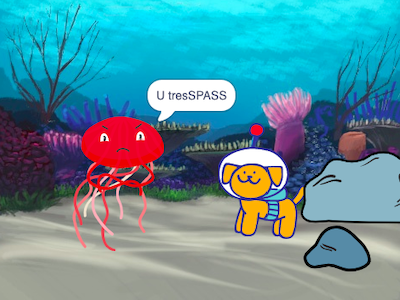

## Melhore o seu projeto

Você pode melhorar o seu projeto adicionando uma reação. Como o seu personagem principal vai reagir? 

Você decide!

--- task ---

O que eles vão fazer? Eles vão dizer algo, fazer um som, mudar de roupa ou se mover?

[[[scratch3-change-costumes-to-show-mood]]]

[[[scratch3-graphic-effects]]]

[[[scratch3-text-to-speech]]]

[[[scratch3-animate-movement-costumes]]]

[[[scratch3-add-sound]]]

[[[scratch3-record-sound]]]

--- /task ---

--- task ---

Você também pode:
+ Adicione ou melhore sua animação, com movimento, visuais e efeitos gráficos
+ Crie ou altere fantasias no editor Paint para deixá-las do jeito que você deseja
+ Grave sua voz ou grave efeitos sonoros e adicione novos sons ao seu projeto

--- /task ---

Programadores profissionais exploram e se inspiram em códigos criados por outros programadores. 

--- task ---

Você também pode olhar os remixes do [Projeto inicial de animação "Surpresa!"](https://scratch.mit.edu/projects/582222532/remixes){:target="_blank"} para ver o que outros criadores fizeram.

--- /task ---

--- task ---

Cada projeto na [Animação "Surpresa!" — Exemplos do Scratch Studio](https://scratch.mit.edu/studios/29075822){:target="_blank"} tem um link **Veja dentro**, que você pode usar para abrir o projeto no editor Scratch e ver o código para ter ideias e ver como o projeto funciona.

**Doppelganger**: [See inside](https://scratch.mit.edu/projects/500767602/editor){:target="_blank"}

  <iframe allowtransparency="true" width="485" height="402" src="https://scratch.mit.edu/projects/embed/500767602/?autostart=false" frameborder="0"></iframe>

--- /task ---

--- task ---

Take a look at our ['Surprise! Surpresa! — comunidade Scratch studio'](https://scratch.mit.edu/studios/29079784){:target="_blank"} para ver projetos criados por membros da comunidade.

--- /task ---

