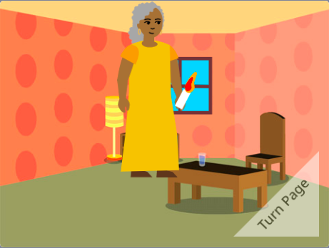

## E agora?

Se você está seguindo o caminho [Introdução ao Scratch](https://projects.raspberrypi.org/en/pathway/scratch-intro), você pode passar para o projeto [Eu fiz um livro para você](https://projects.raspberrypi.org/en/projects/i-made-you-a-book). Neste projeto você fará um livro no Scratch baseado em sua própria ideia.

--- no-print ---

**Light the way home**: [See inside](https://scratch.mit.edu/projects/499860786/editor){:target="_blank"}

  <iframe allowtransparency="true" width="485" height="402" src="https://scratch.mit.edu/projects/embed/499860786/?autostart=false" frameborder="0"></iframe>

[[[comments-feedback-scratch]]]

--- task ---

--- /print-only ---

Se você quiser se divertir mais explorando o Scratch, você pode experimentar qualquer um desses [projetos](https://projects.raspberrypi.org/en/projects?software%5B%5D=scratch&curriculum%5B%5D=%201).

