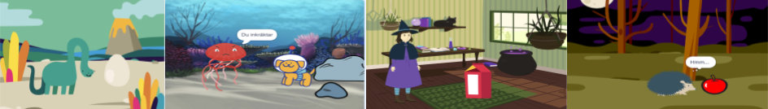

## Du kommer skapa

Skapa en kort animering 🎥 med en rolig överraskning 🎉!

Du kommer:

+ Skapa din egen animering
+ Testa och hitta felen i din kod
+ Skapa din animering ett steg åt gången

--- no-print ---

--- task ---

  

### Spela ▶️ 

Klicka på den gröna flaggan för att se animeringen.

Animeringen har tre delar:
+ Nyfikenhet
+ Överraskning!
+ Reaktion

  <iframe allowtransparency="true" width="485" height="402" src="" frameborder="0"></iframe>

--- /task ---

### Få idéer 💭

--- task ---

Lek med dessa exempelprojekt för att få inspiration. Fundera på hur din animering skulle kunna se ut och kolla på dessa exempelprojekt för att få fler idéer:

⭐ Dela ditt färdiga Överrasknings animeringsprojekt för en chans att få det visat här.

  <iframe allowtransparency="true" width="485" height="402" src="" frameborder="0"></iframe>

  <iframe allowtransparency="true" width="485" height="402" src="" frameborder="0"></iframe>

  <iframe allowtransparency="true" width="485" height="402" src="" frameborder="0"></iframe>

--- /task ---

--- /no-print ---

--- print-only ---

### Få idéer 💭

Du kommer fatta designbeslut och komma på en berättelse för din animering med en överraskning. Fundera på vad din berättelse skulle kunna vara och **Se inuti** exempelprojekt för att få fler idéer om "Överraskning! animeringen -- Exempel" Scratch studio: https://scratch.mit.edu/studios/29075822/

Animeringen har tre delar:
+ Nyfikenhet
+ Överraskning!
+ Reaktion

 

--- /print-only ---

 
