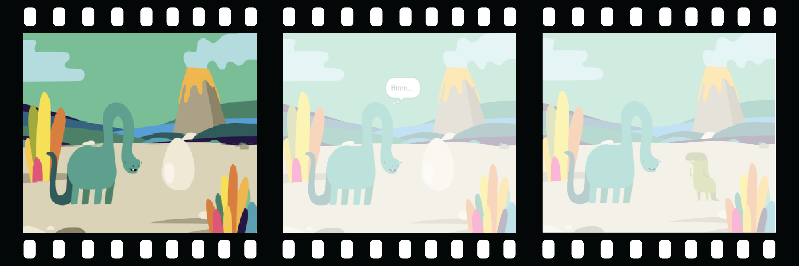
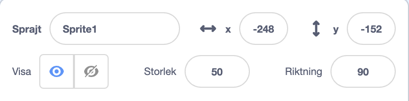
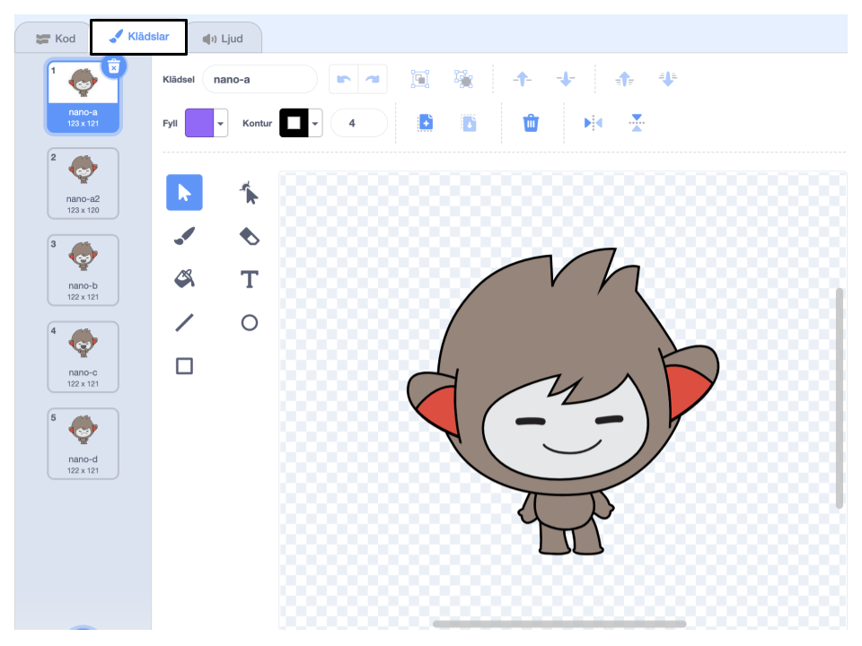
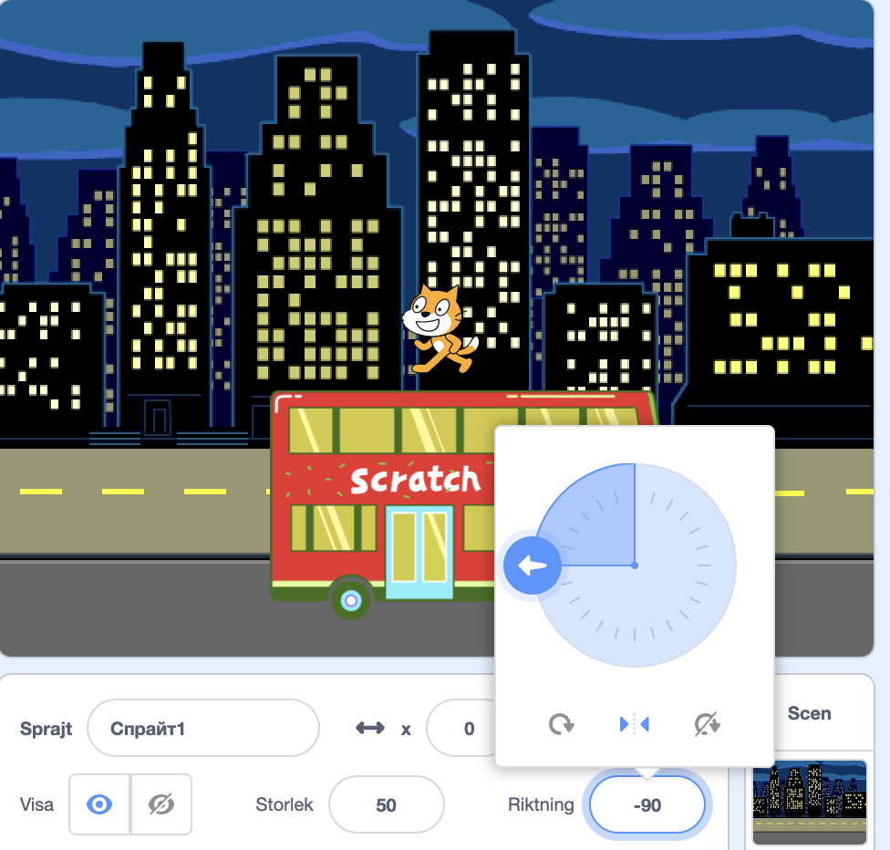

## Skapa din scen

Har du någon idé för din animering?

Lägg till en bakgrund 🖼️, huvudkaraktär 🐙👩‍🦼🦖 och ett intressant objekt 🎂🎾🎁 som du väljer för att skapa en **första del** av din animering.



<p style="border-left: solid; border-width:10px; border-color: #0faeb0; background-color: aliceblue; padding: 10px;">
  <span style="color: #0faeb0">**Animering**</span> kan se ut som rörelse genom att byta bilder snabbt. De första animatörerna ristade bilder i träblock och använde dem som frimärken. Det går mycket snabbare att använda Scratch för att koda din animation!
</p>

### Öppna startprojektet

--- task ---

Öppna [Överaskningen! animeringsstartprojekt](https://scratch.mit.edu/projects/582222532/editor){:target="_blank"}.

⏱️ Inte mycket tid? Du kan utgå från ett av [exemplen](https://scratch.mit.edu/studios/29075822){:target="_blank"}.

--- /task ---

<p style="border-left: solid; border-width:10px; border-color: #0faeb0; background-color: aliceblue; padding: 10px;">
Det finns <span style="color: #0faeb0">**berättelsedesigners**</span> som skriver handlingen för appar och spel. Digitalt berättande låter alla dela sina berättelser och kreativa föreställningar med andra människor.
</p>

### Skapa din scen

--- task ---

**Välj:** ett tema för din animering. Du kan välja:

+ 🐯 Landdjur
+ 🐠 Havsdjur
+ 👽 Utomjordingar
+ 🌿 Natur
+ 🌈 Väder
+ 🌮 Mat
+ 🚀 Resor
+ ⚾ Sport .... Eller något annat

--- /task ---

--- task ---

**Välj:** Välj en sprajt som 🐙👩‍🦼🦖 **huvudkaraktär**, en annan sprajt som det 🎂🎾🎁 **intressanta objektet** och en 🖼️ **bakgrund** för att skapa scenen.


--- /task ---

### Förbered dina sprajter

Var vill du att dina sprajter ska börja? Hur stora vill du att de ska vara? Hur vill du att de ska se ut?

--- task ---

Lägg till ett`när den gröna flaggan klickas på`{:class="block3events"}block och lägg sedan till block under för att ställa in dina sprajter i början av din animering.

**Tips:** Kom ihåg att ställa in både din 🐙👩‍🦼🦖 **huvudkaraktär** och dina 🎂🎾🎁 **intressanta objekt** sprajter.

--- collapse ---
---
title: Placera dina sprajter
---

Flytta 🐙👩‍🦼🦖 **huvudkaraktären** till en valfri plats på scenen, lägg sedan till ett `gå till x: y:`{:class="block3motion"}-block till din kod:

```blocks3
go to x: (0) y: (0) // add the sprite's position
```

Upprepa detta för det 🎂🎾🎁 **intressanta objektet**.

--- /collapse ---

--- collapse ---
---
title: Ändra storlek på dina sprajter
---

För att ändra storleken på en sprajt för hela projektet, ändra numret i egenskapen **Storlek** sprajtrutan:



För att ändra storleken på en sprajt under en del av projektet, använd`sätt storlek till`{:class="block3looks"}blocket. Detta alternativ är bra om du vill att din sprajt ska ändra storlek i projektet.

```blocks3
set size to [100] % // <100 is smaller, >100 is bigger
```

--- /collapse ---

--- collapse ---
---
title: Ställ in dina sprajters klädslar
---

För att ändra klädseln på en sprajt under hela projektet, klicka på fliken **klädslar** och välj en av de tillgängliga klädslarna:



För att ändra klädseln på en sprajt under projektets gång, lägg till ett `ändra klädsel till`{:class="block3looks"}-block till din kod och uppdatera den för att visa ditt val av klädsel:

```blocks3
switch costume to [ v]  // update this for your chosen costume
```

För att dölja en sprajt i början av projektet, lägg till ett `dölj`{:class="block3looks"}block till din kod:

```blocks3
hide 
```

--- /collapse ---

--- collapse ---
---
title: Ställ in riktningen för dina sprajter
---

Dina sprajter kan vara vända åt fel håll när du lägger till dem i ditt projekt.

För att ändra riktning på en sprajt för hela projektet, ändra **riktning** och **rotationsstil** i sprajtrutan:



För att ändra riktning av en sprajt under en del av projektet, lägg till block som ändrar `rotationsstil`{:class="block3motion"} och `riktning`{:class="block3motion"}:

```blocks3
set rotation style [left-right v]
point in direction (-90) // turn to the left
```

--- /collapse ---

--- /task ---

--- task ---

Spara ditt projekt.

[[[generic-scratch3-saving]]]

--- /task ---
