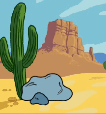

## Visa nyfikenhet

Kommer föremålet göra något som drar till sig uppmärksamhet? Hur kommer karaktären reagera? Du väljer! Skapa den **andra delen** av din animering.


<p style="border-left: solid; border-width:10px; border-color: #0faeb0; background-color: aliceblue; padding: 10px;">
  <span style="color: #0faeb0">**Nedbrytning**</span> är att bryta ner ett projekt i delar som är mindre och lättare att förstå. Detta betyder att du kan skapa ditt projekt ett steg i taget tills du är klar med det. I detta steg kommer du endast fokusera på den nyfikna delen av din animering.
</p>

### Föremålet

--- task ---

**Välj:** Om du vill att det 🎂🎾🎁 **intressanta objektet** ska göra något för att dra till sig uppmärksamhet, välj vad objektet ska göra.



Lägg till block i slutet av det 🎂🎾🎁 **intressanta objektets** `när gröna flaggan klickas på`{:class="block3events"}startkod.

[[[scratch3-jiggle-a-sprite]]]

[[[scratch3-graphic-effects]]]

--- /task ---

### Karaktären

--- task ---

Få 🐙👩‍🦼🦖 **huvudkaraktären** att bli intresserad av objektet. Lägg till block i slutet av 🐙👩‍🦼🦖 **huvudkaraktärens**startkoden.

Om du vill att 🐙👩‍🦼🦖 **huvudkaraktären** väntar tills det 🎂🎾🎁 **intressanta objektet** har gjort något, lägg till ett `vänta`{:class="block3control"} block.


Du kan använda `säg`{:class="block3looks"}- eller `tänk`{:class="block3looks"}block, eller till och med`text till tal`{:class="block3extensions"}-tillägg för att få karaktärer att prata högt!

[[[scratch3-text-to-speech]]]

Karaktären skulle kunna gestikulera såsom i [Rymdsamtals](https://projects.raspberrypi.org/en/projects/space-talk){:target="_blank"}projektet.

[[[scratch3-change-costumes-to-show-mood]]]

Karaktären kan vara modig och flytta närmare föremålet för att undersöka det.

[[[scratch3-animate-movement-costumes]]]

--- /task ---

--- task ---

**Test:** Klicka på den gröna flaggan för att testa ditt projekt. 🐙👩‍🦼🦖 **Huvudkaraktären** bör visa nyfikenhet för objektet.

Klicka på den gröna flaggan igen. Om du ändrade det 🎂🎾🎁 **intressanta objektets**- eller 🐙👩‍🦼🦖 **huvudkaraktär** sprajtens position eller utseende måste du se till att de återställs till sin startposition eller startutseende när du kör projektet igen.

--- collapse ---
---
title: Ställ in startpositionen och utseendet för en sprajt
---

Välj de block som du behöver för att ställa in positionen och utseendet i början.

```blocks3
when flag clicked // add blocks to set up the start 
switch costume to [costume1 v]
set size to (100) % // starting size
go to x: (-200) y: (50) // starting position
point in direction [90]
set [brightness v] effect to [80]
show
```

**Tips:** Alla bildeffekter tas bort när du klickar på den gröna flaggan så du behöver inte ta bort dem manuellt, men du kanske behöver ställa in de effekter som du vill att sprajten ska ha.

--- /collapse ---

--- /task ---

--- task ---

**Debug (Felsökning):**

--- collapse ---
---
title: Ljudet fungerar inte
---

Kontrollera att volymen på din dator eller surfplatta är tillräckligt hög och att dina högtalare eller hörlurar är anslutna och fungerar som de ska.

--- /collapse ---

--- collapse ---
---
title: Min animation återställs inte ordentligt när jag klickar på den gröna flaggan
---

Kontrollera att ditt projekt har `när grön flagga klickas på`{:class="block3events"}-block för de sprajter som behöver dem, och kontrollera att de återställer position, storlek och utseende för sprajterna. För hjälp med detta, se **Ställ in startpositionen och leta efter en sprajt** -uppgiften ovan.

--- /collapse ---

--- /task ---

