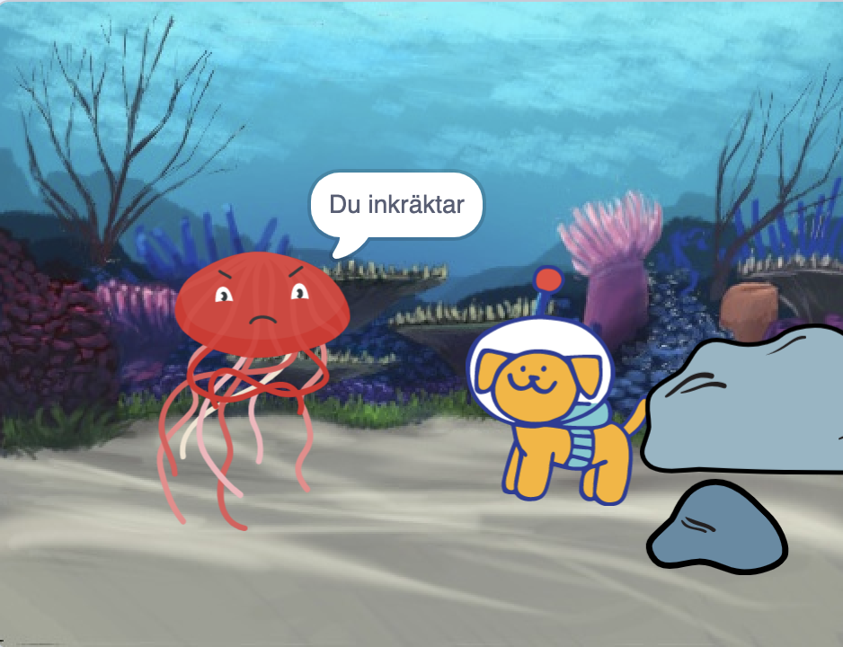

## Uppgradera ditt projekt

Du kan uppgradera ditt projekt genom att lägga till en reaktion. Hur kommer din huvudkaraktär reagera? 

Du väljer!

--- task ---

Vad kommer de göra? Kommer de att säga något, göra ett ljud, byta klädsel eller röra på sig?

[[[scratch3-change-costumes-to-show-mood]]]

[[[scratch3-graphic-effects]]]

[[[scratch3-text-to-speech]]]

[[[scratch3-animate-movement-costumes]]]

[[[scratch3-add-sound]]]

[[[scratch3-record-sound]]]

--- /task ---

--- task ---

Du kan även:
+ Lägg till eller förbättra din animering, med rörelse, utseende och bildeffekter
+ Skapa eller redigera klädslar i målarredigeraren för att få dem att se ut precis som du vill
+ Spela in din röst eller spela in ljudeffekter och lägg till de nya ljuden i ditt projekt

--- /task ---

Professionella programmerare utforskar och hämtar inspiration från kod skapad av andra programmerare. 

--- task ---

Du kan även kolla på remixarna av ["Startprojektet i överraskningsanimering](https://scratch.mit.edu/projects/582222532/remixes){:target="_blank"} för att se vad andra har gjort.

--- /task ---

--- task ---

Varje projekt i ['Överraskningen! animering — Exempel Scratch studio](https://scratch.mit.edu/studios/29075822){:target="_blank"} har en **Se inuti** -länk, som du kan använda för att öppna projektet i Scratch-redigeraren och titta på koden för att få idéer och se hur projektet fungerar.

**Dubbelgångare**: [Se inuti](https://scratch.mit.edu/projects/500767602/editor){:target="_blank"}

  <iframe allowtransparency="true" width="485" height="402" src="https://scratch.mit.edu/projects/embed/500767602/?autostart=false" frameborder="0"></iframe>

--- /task ---

--- task ---

Ta en titt på vår ['Överraskning! animering — Community' Scratch studio](https://scratch.mit.edu/studios/29079784){:target="_blank"} för att se projekt skapade av communitymedlemmar.

--- /task ---

