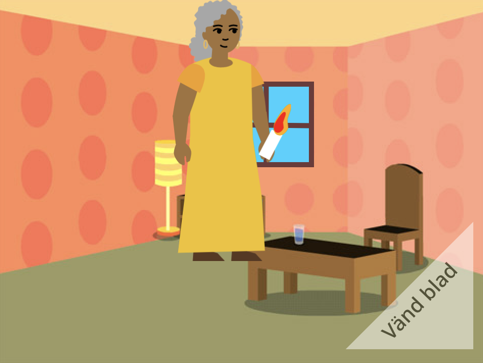

## Vad händer nu?

Om du följer [Introduktion till Scratch](https://projects.raspberrypi.org/en/pathway/scratch-intro)-vägen kan du gå vidare till [Jag har gjort en bok till dig](https://projects.raspberrypi.org/en/projects/i-made-you-a-book) -projektet. I det här projektet kommer du att göra en bok i Scratch utifrån din egen idé.

--- no-print ---

**Lys upp vägen hem**: [Se inuti](https://scratch.mit.edu/projects/499860786/editor){:target="_blank"}

  <iframe allowtransparency="true" width="485" height="402" src="https://scratch.mit.edu/projects/embed/499860786/?autostart=false" frameborder="0"></iframe>

--- /no-print ---

--- print-only ---

--- /print-only ---

Om du vill ha mer kul med att utforska Scratch kan du prova något av [dessa projekt](https://projects.raspberrypi.org/en/projects?software%5B%5D=scratch&curriculum%5B%5D=%201).

