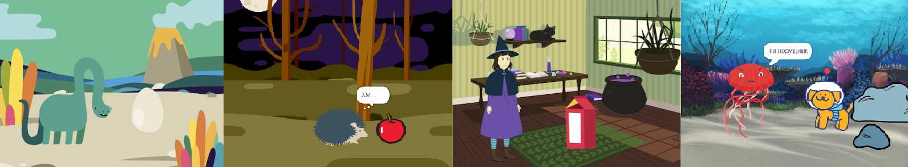
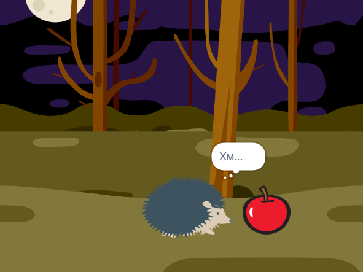

## Ти зробиш

Створення короткометражної анімації 🎥 з веселим сюрпризом 🎉!

Зможеш:

+ Створити власну анімацію
+ Тестувати та налагоджувати свій код
+ Побудувати свою анімацію по частинах

--- no-print ---

--- task ---

  

### Грати ▶️ 

Натисни на зелений прапорець, щоб переглянути анімацію.

Анімація складається з трьох частин:
+ Цікавість
+ Сюрприз!
+ Реакція

**Сюрприз для динозавра!**: [Переглянути код](https://scratch.mit.edu/projects/495932563/editor){:target="_blank"}

  <iframe allowtransparency="true" width="485" height="402" src="https://scratch.mit.edu/projects/embed/495932563/?autostart=false" frameborder="0"></iframe>

--- /task ---

### Отримай ідеї 💭

--- task ---

Пограйся з цими прикладами проєктів, щоб отримати ідеї. Подумай, якою може бути твоя анімація, і вивчи ці приклади проєктів, щоб отримати більше ідей:

⭐ Поділися своїм готовим проєктом Сюрприз, щоб мати шанс бути опублікованим у цьому списку.

**БУУ!**: [Переглянути код](https://scratch.mit.edu/projects/498655116/editor){:target="_blank"}

  <iframe allowtransparency="true" width="485" height="402" src="https://scratch.mit.edu/projects/embed/498655116/?autostart=false" frameborder="0"></iframe>

**Магія кота**: [Переглянути код](https://scratch.mit.edu/projects/498615133/editor){:target="_blank"}

  <iframe allowtransparency="true" width="485" height="402" src="https://scratch.mit.edu/projects/embed/498615133/?autostart=false" frameborder="0"></iframe>

**⭐ Страх перед стрибком!**: [Переглянути код](https://scratch.mit.edu/projects/720220722/editor){:target="_blank"} (проєкт спільноти)

  <iframe allowtransparency="true" width="485" height="402" src="https://scratch.mit.edu/projects/embed/720220722/?autostart=false" frameborder="0"></iframe>

--- /task ---

--- /no-print ---

--- print-only ---

### Отримай ідеї 💭

Ти будеш приймати дизайнерські рішення та придумувати історію для своєї анімації з сюрпризом. Подумай, якою може бути твоя історія, а щоб отримати більше ідей, **Переглянь код** прикладів проєктів 'Сюрприз! Scratch 'Анімація Сюрпризу! — Приклади' https://scratch.mit.edu/studios/29075822/

Анімація складається з трьох частин:
+ Цікавість
+ Сюрприз!
+ Реакція

 

--- /print-only ---

 
