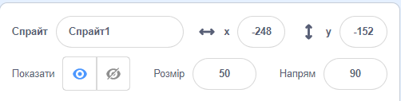
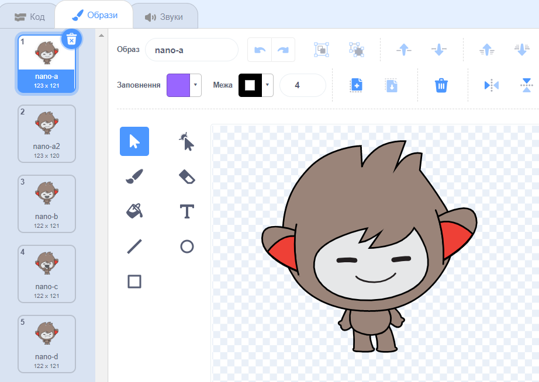
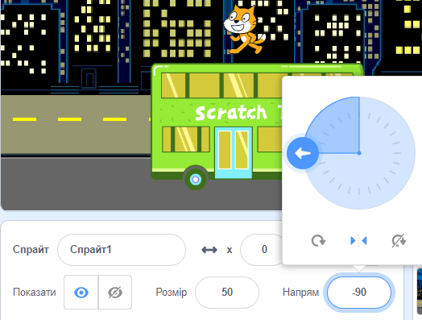

## Створення своєї сцени

У тебе вже є ідея щодо твоєї анімації?

Додай тло 🖼️, головного персонажа🐙👩‍🦼🦖 та цікавий об'єкт 🎂🎾🎁 на свій вибір, щоб створити **першу частину** твоєї анімації.


<p style="border-left: solid; border-width:10px; border-color: #0faeb0; background-color: aliceblue; padding: 10px;">
  <span style="color: #0faeb0">**Анімація**</span> створює ефект руху внаслідок швидкої зміни картинок. Перші аніматори вирізали картинки з дерев'яних брусків та використовували їх як штампи. Набагато швидше кодувати анімацію за допомогою Scratch!
</p>

### Відкрий початковий проєкт

--- task ---

Відкрий ['Сюрприз! стартовий проєкт Сюрприз!](https://scratch.mit.edu/projects/582222532/editor){:target="_blank"}.

⏱️ Недостатньо часу? Ти можеш почати з одного з [прикладів](https://scratch.mit.edu/studios/29075822){:target="_blank"}.

--- /task ---

<p style="border-left: solid; border-width:10px; border-color: #0faeb0; background-color: aliceblue; padding: 10px;">
Є люди, яких називають <span style="color: #0faeb0">**наративні дизайнери**</span> - вони займаються оповіданнями для додатків та відеоігор. Цифрове оповідання дозволяє кожному ділитися своїми історіями та творчими уявами з іншими людьми.
</p>

### Розроби свою сцену

--- task ---

**Обери:** тему для своєї анімації. Ти можеш вибирати:

+ 🐯 Наземні тварини
+ 🐠 Морські тварини
+ 👽 Інопланетяни
+ 🌿 Природа
+ 🌈 Погода
+ 🌮 Їжа
+ 🚀 Подорожування
+ ⚾ Спорт .... Або щось інше

--- /task ---

--- task ---

**Вибір:** Обери спрайт, який буде 🐙👩‍🦼🦖 **головним персонажем**, інший спрайт, який буде 🎂🎾🎁 **цікавим об'єктом** та 🖼️ **тло**, щоб встановити сцену.


--- /task ---

### Підготуй спрайти

Як ти хочеш, щоб твої спрайти стартували? Наскільки великими ти хочеш її зробити? Як ти хочеш, щоб вони виглядали?

--- task ---

Додай блок `коли зелений прапорець натиснуто`{:class="block3events"}, потім, під ним, додай блоки, щоб налаштувати спрайти на початку анімації.

**Порада:** Не забувай налаштувати спрайти, як 🐙👩‍🦼🦖 **головного персонажа**, так і 🎂🎾🎁 **цікавих об'єктів**.

--- collapse ---
---
title: Розміщення спрайтів
---

Переміщай🐙👩‍🦼🦖 **головного персонажа** у потрібну тобі позицію на Сцені, а потім додай блок `перемістити в x: y:`{:class="block3motion"} до свого коду:

```blocks3
go to x: (0) y: (0) // задати позицію спрайта
```

Зроби те саме для 🎂🎾🎁 **цікавого об'єкту**.

--- /collapse ---

--- collapse ---
---
title: Зміна розміру спрайтів
---

Щоб змінити розмір спрайта для всього проєкту, зміни число у властивості **Розмір** на панелі Спрайтів:



Щоб змінити розмір спрайта для частини проєкту, додай код `задати розмір`{:class="block3looks"} на потрібний тобі розмір. Цей варіант зручний, якщо ти хочеш, щоб спрайт змінював розмір у проєкті.

```blocks3
set size to [100] % // <100 - менше, >100 - більше
```

--- /collapse ---

--- collapse ---
---
title: Налаштуй образи своїх спрайтів
---

Щоб змінити образ спрайта для всього проєкту, натисни на вкладку **Образи** та обери один з доступних костюмів:



Щоб змінити костюм спрайта для частини проєкту, додай блок `змінити образ на`{:class="block3looks"} до свого коду та онови його, щоб відобразити обраний тобою костюм:

```blocks3
switch costume to [ v]  // зміни на обраний тобою образ
```

Щоб сховати спрайт на початку проєкту, додай блок `сховати`{:class="block3looks"} до свого коду:

```blocks3
hide 
```

--- /collapse ---

--- collapse ---
---
title: Встановлення напрямку руху спрайтів
---

Твої спрайти можуть бути повернуті неправильним боком, коли ти додаєш у свій проєкт.

Щоб змінити напрямок спрайта для всього проєкту, зміни **Напрям** та **стиль обертання** на панелі Спрайтів:



Щоб змінити напрямок спрайта для частини проєкту, додай блоки коду, щоб змінювати `стиль обертання`{:class="block3motion"} та `напрям`{:class="block3motion"}:

```blocks3
set rotation style [left-right v]
point in direction (-90) // повернути ліворуч
```

--- /collapse ---

--- /task ---

--- task ---

Збережіть свій проект.

[[[generic-scratch3-saving]]]

--- /task ---
