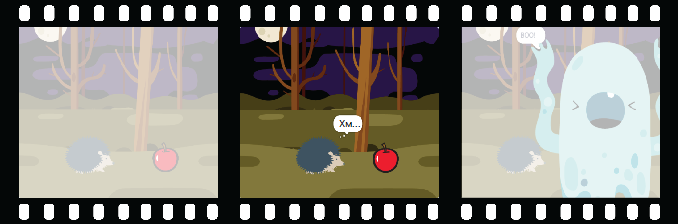

## Проявляй допитливість

Чи буде об'єкт робити щось, що приверне до себе увагу? Як відреагує персонаж? Це тобі вирішувати! Створи **другу частину** своєї анімації.



<p style="border-left: solid; border-width:10px; border-color: #0faeb0; background-color: aliceblue; padding: 10px;">
  <span style="color: #0faeb0">**Декомпозиція **</span> - це розбиття проєкту на частини, які є меншими і легшими для розуміння. Це означає, що ти можеш будувати проєкт поступово, поки не завершиш його. На цьому етапі ти будеш зосереджуватися лише на цікавій частині своєї анімації.
</p>

### Об'єкт

--- task ---

**Обери:** Якщо ти хочеш, щоб 🎂🎾🎁 **цікавий об'єкт** щось робив та привертав до себе увагу, вибери, що саме буде робити об'єкт.


Додай блоки в кінець скрипта налаштування 🎂🎾🎁 **цікавого об'єкта** `коли зелений прапорець натиснуто`{:class="block3events"}.

[[[scratch3-jiggle-a-sprite]]]

[[[scratch3-graphic-effects]]]

--- /task ---

### Персонаж

--- task ---

Змусь 🐙👩‍🦼🦖 **головного персонажа** проявити інтерес до об'єкта. Додай блоки в кінець скрипта налаштування 🐙👩‍🦼🦖 **головного персонажа**.

Якщо ти хочеш, щоб 🐙👩‍🦼🦖 **головний персонаж** дочекався, поки 🎂🎾🎁 **цікавий об'єкт** щось зробить, додай блок `чекати`{:class="block3control"}.


Ти можеш скористатися блоками `говорити`{:class="block3looks"} або `подумати`{:class="block3looks"}, або навіть скористатися розширенням `Текст у мову`{:class="block3extensions"}, щоб змусити персонажа говорити вголос!

[[[scratch3-text-to-speech]]]

Персонаж може виражати емоції, як, наприклад, у проєкті [Космічна розмова](https://projects.raspberrypi.org/en/projects/space-talk){:target="_blank"}.

[[[scratch3-change-costumes-to-show-mood]]]

Персонаж може набратися сміливості та підійти ближче, щоб розглянути об'єкт.

[[[scratch3-animate-movement-costumes]]]

--- /task ---

--- task ---

**Тест:** Клацни на зелений прапорець, щоб протестувати свій проєкт. 🐙👩‍🦼🦖 **Головний персонаж** повинен проявляти цікавість до об'єкта.

Клацни на зелений прапорець ще раз. Якщо було змінено позицію або зовнішній вигляд спрайта 🎂🎾🎁 **цікавого об'єкта** або 🐙👩‍🦼🦖 **головного персонажа**, переконайся, що при повторному запуску проєкту вони будуть повернуті до початкового положення або вигляду.

--- collapse ---
---
title: Встанови стартову позицію та вигляд спрайта
---

Вибери блоки, які тобі потрібні, щоб задати позицію та вигляд спрайта на старті.

```blocks3
when flag clicked // add blocks to set up the start 
switch costume to [costume1 v]
set size to (100) % // starting size
go to x: (-200) y: (50) // starting position
point in direction [90]
set [brightness v] effect to [80]
show
```

**Порада:** Всі графічні ефекти скидаються при натисканні на зелений прапорець, тому тобі не потрібно їх скидати, але тобі може знадобитися встановити ефекти, які ти хочеш, щоб спрайт мав.

--- /collapse ---

--- /task ---

--- task ---

**Налагодження:**

--- collapse ---
---
title: Звук не працює
---

Переконайся, що гучність комп'ютера або планшета достатньо висока, а динаміки або навушники підключені та працюють правильно.

--- /collapse ---

--- collapse ---
---
title: Моя анімація не запускається правильно, коли я натискаю на зелений прапорець
---

Переконайся, що твій проєкт має скрипт `коли зелений прапорець натиснуто`{:class="block3events"} для спрайтів, які їх потребують, та переконайся, що вони скинули позицію, розмір та зовнішній вигляд спрайтів. Допомогу в цьому можна знайти в завданні вище **Встанови стартову позицію та вигляд спрайта**.

--- /collapse ---

--- /task ---

