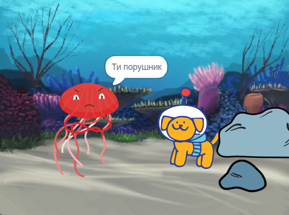

## Вдосконалення твого проєкту

Ти можеш вдосконалити свій проєкт, додавши реакцію. Як відреагує твій головний персонаж? 

Це тобі вирішувати!

--- task ---

Що вони будуть робити? Чи будуть вони щось говорити, видавати звуки, змінювати образи, рухатися?

[[[scratch3-change-costumes-to-show-mood]]]

[[[scratch3-graphic-effects]]]

[[[scratch3-text-to-speech]]]

[[[scratch3-animate-movement-costumes]]]

[[[scratch3-add-sound]]]

[[[scratch3-record-sound]]]

--- /task ---

--- task ---

Ти також можеш:
+ Додати або покращити свою анімацію за допомогою руху, вигляду та графічних ефектів
+ Створити або редагувати образи в редакторі Малювання, щоб вони виглядали так, як ти хочеш
+ Записати свій голос або записати звукові ефекти та додати нові звуки до свого проєкту

--- /task ---

Професійні програмісти досліджують та надихаються кодом, створеним іншими програмістами. 

--- task ---

Також ти можеш ознайомитися з реміксами [Стартових проєктів - Сюрприз!](https://scratch.mit.edu/projects/582222532/remixes){:target="_blank"} та подивитися, що зробили інші автори.

--- /task ---

--- task ---

Кожен проєкт ["Сюрприз! Scratch 'Анімація Сюрпризу! — Приклади'](https://scratch.mit.edu/studios/29075822){:target="_blank"} має посилання **Переглянути код**, за допомогою якої можна відкрити проєкт в редакторі Scratch і подивитися на код, щоб отримати ідеї та побачити, як працює проєкт.

  <iframe allowtransparency="true" width="485" height="402" src="" frameborder="0"></iframe>

--- /task ---

--- task ---

Ознайомся з нашими проєктами ['Сюрприз! Scratch 'Анімація Сюрпризу!' — Спільнота](https://scratch.mit.edu/studios/29079784){:target="_blank"}, щоб переглянути проєкти, створені учасниками спільноти.

--- /task ---

