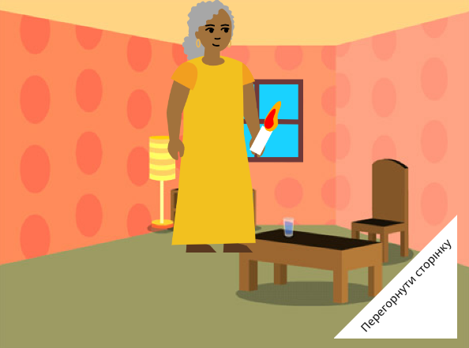

## Що далі?

Якщо ти йдеш по проєктах [Знайомство зі Scratch](https://projects.raspberrypi.org/uk-UA/pathway/scratch-intro), можеш перейти до проєкту [Я зробив тобі книжку](https://projects.raspberrypi.org/uk-UA/projects/i-made-you-a-book). У цьому проєкті ти будеш створювати книгу у Scratch за власною ідеєю.

--- no-print ---

**Освітли дорогу додому**: [Переглянути код](https://scratch.mit.edu/projects/757493452/editor){:target="_blank"}

  <iframe allowtransparency="true" width="485" height="402" src="https://scratch.mit.edu/projects/embed/757493452/?autostart=false" frameborder="0"></iframe>

--- /no-print ---

--- print-only ---

--- /print-only ---

Якщо ти хочеш більш цікаво вивчати Scratch, можеш спробувати будь-який з [цих проєктів](https://projects.raspberrypi.org/uk-UA/projects?software%5B%5D=scratch&curriculum%5B%5D=%201).
