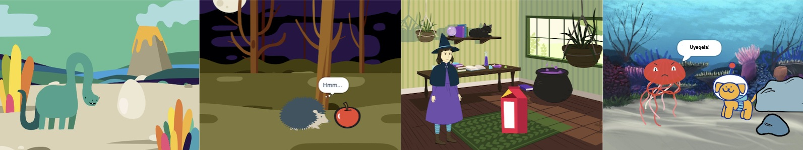

## Uzakwena

Yenza upopayi omfutshane 🎥 onokumangala okumnandi 🎉!

Uzaku:

+ Yenza owakho upopayi
+ Vavanya kwaye ulungise ikhowudi yakho
+ Yakha upopayi wakho inxalenye enye ngexesha

--- no-print ---

--- task ---

  

### Dlala ▶️ 

Cofa kwiflegi eluhlaza ukuze ubukele upopayi.

Upopayi uneenxalenye ezintathu:
+ Ukufuna ukwazi
+ Ukumangala!
+ Ukusabela

**Isimanga seDayinaso!**: [Jonga ngaphakathi](https://scratch.mit.edu/projects/1295552590/editor){:target="_blank"}

  <iframe allowtransparency="true" width="485" height="402" src="https://scratch.mit.edu/projects/embed/1295552590/?autostart=false" frameborder="0"></iframe>

--- /task ---

### Fumana izimvo 💭

--- task ---

Dlala ngale mizekelo ukuze ufumana izimvo. Cinga ngokuba inokuba yintoni na upopayi wakho, kwaye uhlole le mizekelo yeeprojekthi ukuze ufumane ezinye izimvo:

⭐ Yabelana ngeprojekthi yakho yopopayi omangalisayo egqityiweyo ukuze ube nethuba lokuba iboniswe apha.

**BOO!**: [Bona ngaphakathi](https://scratch.mit.edu/projects/1295553428/editor){:target="_blank"}

  <iframe allowtransparency="true" width="485" height="402" src="https://scratch.mit.edu/projects/embed/1295553428/?autostart=false" frameborder="0"></iframe>

**Umlingo wekati**: [Bona ngaphakathi](https://scratch.mit.edu/projects/1295554035/editor){:target="_blank"}

  <iframe allowtransparency="true" width="485" height="402" src="https://scratch.mit.edu/projects/embed/1295554035/?autostart=false" frameborder="0"></iframe>

**⭐ Ukothuka!**: [Bona ngaphakathi](https://scratch.mit.edu/projects/720220722/editor){:target="_blank"} (iprojekthi yoluntu ebalaseleyo)

  <iframe allowtransparency="true" width="485" height="402" src="https://scratch.mit.edu/projects/embed/720220722/?autostart=false" frameborder="0"></iframe>

--- /task ---

--- /no-print ---

--- print-only ---

### Fumana izimvo

Uza kwenza izigqibo zoyilo kwaye ucinge ngebali lopopayi wakho enento emangalisayo. Cinga ngokuba ibali lakho linokuba yintoni, kwaye ukuze ufumane ezinye izimvo, **Bona ngaphakathi** imizekelo iiprojekthi ezimangalisayo'! oopopayi — Imizekelo Istudiyo sakwa Scratch: https://scratch.mit.edu/studios/29075822/

Upopayi uneenxalenye ezintathu:
+ Ukufuna ukwazi/Umdla
+ U-Mmangaliso!
+ Ukusabela

--- /print-only ---

 
