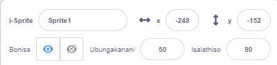
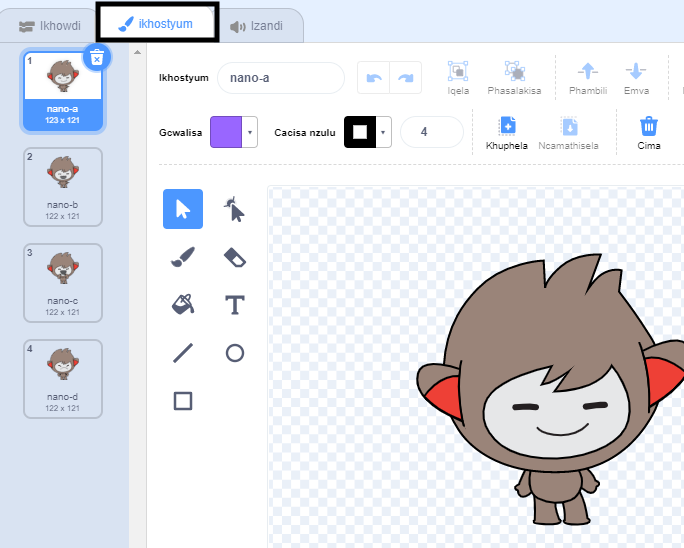
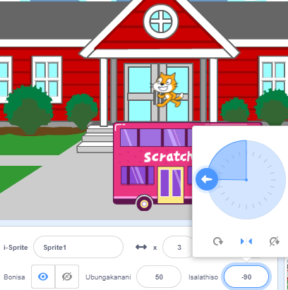

## Yenza umboniso wakho

Ingaba unombono malunga nopopayi wakho?

Yongeza umfanekiso wangasemva 🖼️, umlinganiswa ophambili 🐙👩‍🦼🦖, kunye nento enomdla 🎂🎾🎁 ekhethwe nguwe ukwenza **indawo yokuqala** yopopayi wakho.


<p style="border-left: solid; border-width:10px; border-color: #0faeb0; background-color: aliceblue; padding: 10px;">
  <span style="color: #0faeb0">** Upopayi**</span> wenza isphumo sentshukumo ngokutshintsha imifanekiso ngokukhawulezisa. Abenzi bokuqala bopopayi babekrola iinkuni baze bazenze izitampu. Ukusebenzisa u-Scratch ekubhaleni ikhowudi yokwenza upopayi wakho, kuyakhaulezisa kakhulu!
</p>

### Vula iprojekthi yokuqalisa

--- task ---

Vula [Ummangaliso! iprojekthi yokuqala oopopayi](https://scratch.mit.edu/projects/582222532/editor){:target="_blank"}.

⏱️ Akukho xesha elininzi? Ungaqala komnye [wemizekelo](https://scratch.mit.edu/studios/29075822){:target="_blank"}.

--- /task ---

<p style="border-left: solid; border-width:10px; border-color: #0faeb0; background-color: aliceblue; padding: 10px;">
Kukho abantu ababizwa <span style="color: #0faeb0">**abaqulunqi beembali**</span> abenza amabali eeApps kunye nemidlalo yevidiyo. Amabali adijithali avumela bonke abantu uba babelane ngamabali abo nemifanekiso enobuchule kunye nabanye abantu.
</p>

### Yakha umboniso wakho

--- task ---

**Khetha:** umxholo wopopayi wakho. Unokukhetha:

+ 🐯 Izilwanyana zasemhlabeni
+ 🐠 Izilwanyana zaselwandle
+ 👽 ii-Aliyeni
+ 🌿 Indalo
+ 🌈 Imozulu
+ 🌮 Ukutya
+ 🚀 Ukuhamba
+ ⚾ Ezemidlalo
....Okanye enye into

--- /task ---

--- task ---

**Khetha:** Khetha isprite sibe ngo🐙👩‍🦼🦖 ** owona mlinganiswa**, esinye isprite sibe yi 🎂🎾🎁**into enomdla** kunye no 🖼️**mfanekiso wangasemva** ukuze wenze umboniso.


--- /task ---

### Lungisa iziprite yakho

Ufuna ziqale phi iziprite zakho? Ufuna zibe nkulu kangakanani? Ufuna zibene nkangeleko enjani?

--- task ---

Yongeza i `xa iflegi eluhlaza icofiwe`{:class="block3events"} ibhlokhi, emva koko, ngaphantsi, yongeza iibhloko ukuseta iziprite zakho ekuqaleni komfanekiso wakho woopopayi.

**Ingcebiso:** Khumbula ukubeka 🐙👩‍🦼🦖 **owona mlinganiswa** kunye ne 🎂🎾🎁 **nto enomdla** yakho ye ziprite.

--- collapse ---
---
title: Misa iziprite zakho ngohlobo.
---

Hambisa i-🐙👩‍🦼🦖 **umlinganiswa oyintloko** kwindawo oyikhethileyo kwiQonga, uze wongeze i-`yiya ku-x: y:`{:class="block3motion"} ibhloko kwikhowudi yakho:

```blocks3
go to x: (0) y: (0) // yongeza indawo ye-sprite
```

Phinda lo msebenzi kwi 🎂🎾🎁 **into enomdla**.

--- /collapse ---

--- collapse ---
---
title: Tshintsha ubungakanani be-sprites zakho
---

Ukutshintsha ubungakanani be-sprite kwiprojekthi yonke, tshintsha inani elikwipropathi ye-**Size** kwi payini ye-Sprite:



Ukuze utshintshe ubungakanani be-sprite kwinxalenye yeprojekthi, yongeza ikhowudi kwi-`setha ubungakanani kwi-`{:class="block3looks"} ubukhulu obukhethileyo. Olu khetho lulungile ukuba ufuna i-sprite sakho sitshintshe ubungakanani kwiprojekthi.

```blocks3
set size to [100] % // <100 incinci, >100 inkulu
```

--- /collapse ---

--- collapse ---
---
title: Beka izinxibo ze-sprites zakho
---

Ukutshintsha isinxibo se-sprite kwi projekthi le yonke, cofa kwithebhu ethi **Izinxibo** uze ukhethe enye yezinxibo ezikhoyo:



Ukuze utshintshe isinxibo se-sprite kwinxalenye yeprojekthi, yongeza i-`tshintsha isinxibo kwi-`{:class="block3looks"} block kwikhowudi yakho kwaye uyihlaziye ukuze ibonise isinxibo osithandayo:

```blocks3
switch costume to [ v]  // hlaziya oku kwisinxibo sakho osikhethileyo
```

Ukufihla i-sprite ekuqaleni kweprojekthi, yongeza ibhloko yo-`fihla`{:class="block3looks"} kwikhowudi yakho:

```blocks3
hide 
```

--- /collapse ---

--- collapse ---
---
title: Seta isalathiso se-sprite sakho
---

Ii-sprites zakho zisenokuba zijongene ngendlela engeyiyo xa uzongeza kwiprojekthi yakho.

Ukuze utshintshe indlela yokuqondisa ye-sprite kwi iprojekthi yonke, tshintsha **indlela yokuqondisa** kunye ne-**simbo sokujikeleza** kwipayini ye-Sprite:



Ukuze utshintshe indlela yokuqondisa ye-sprite kwinxalenye yeprojekthi, yongeza iibhloko kwikhowudi yakho ukuze utshintshe i-`simbo sokujikeleza`{:class="block3motion"} kunye ne-`ndlela yokuqondisa`{:class="block3motion"}:

```blocks3
set rotation style [ekhohlo-ekunene v]
point in direction (-90) // jika uye ngasekhohlo
```

--- /collapse ---

--- /task ---

--- task ---

Gcina iprojekthi yakho.

[[[generic-scratch3-saving]]]

--- /task ---
