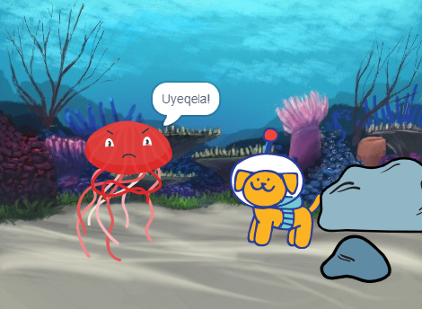

## Phucula iprojekthi yakho

Ungayiphucula iprojekthi yakho ngokongeza impendulo. Uza kusabela njani umlinganiswa wakho oyintloko? 

Kugqiba wena!

--- task ---

Baza kwenza ntoni? Ngaba baza kuthetha into ethile, benze isandi, batshintshe isinxibo, okanye bashukume?

[[[scratch3-change-costumes-to-show-mood]]]

[[[scratch3-graphic-effects]]]

[[[scratch3-text-to-speech]]]

[[[scratch3-animate-movement-costumes]]]

[[[scratch3-add-sound]]]

[[[scratch3-record-sound]]]

--- /task ---

--- task ---

Usenoku:
+ Yongeza okanye uphucule upopayi wakho, ngentshukumo, inkangeleko, kunye nemiphumo yemizobo
+ Yenza okanye uhlele izinxibo kumhlei wepeyinti ukuze zibukeke ngendlela oyifunayo
+ Rekhoda ilizwi lakho okanye urekhode imiphumo yezandi uze wongeze izandi ezintsha kwiprojekthi yakho

--- /task ---

Abadwelisi benkqubo abaqeqeshiweyo bahlola kwaye bafumane ugqozi kwikhowudi ezenziwe ngabanye abadwelisi beenkqubo. 

--- task ---

Ungajonga nee-remixes ze- [Projekthi yokuqala yoopopayi engumangaliso](https://scratch.mit.edu/projects/582222532/remixes){:target="_blank"} ukuze ubone ukuba abanye abadali benze ntoni.

--- /task ---

--- task ---

Iprojekthi nganye ku ['Mangaliso!' oopopayi — Imizekelo ye studiyo sikaScratch](https://scratch.mit.edu/studios/29075822){:target="_blank"} ine- **Bona ngaphakathi** khonco, onokuyisebenzisa ukuvula iprojekthi kumhleli kaScratch kwaye ujonge ikhowudi ukuze ufumane izimvo kwaye ubone indlela iprojekthi esebenza ngayo.

**Idoppelganger**: [Bona ngaphakathi](https://scratch.mit.edu/projects/500767602/editor){:target="_blank"}

  <iframe allowtransparency="true" width="485" height="402" src="https://scratch.mit.edu/projects/embed/500767602/?autostart=false" frameborder="0"></iframe>

--- /task ---

--- task ---

Jonga into yethu e- ['Mangalisyo! oopopayi — Istudiyo soLuntu luka Scratch](https://scratch.mit.edu/studios/29079784){:target="_blank"} ukuze ubone iiprojekthi ezenziwe ngamalungu oluntu.

--- /task ---

