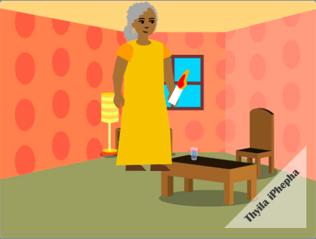

## Kulandela ntoni?

Ukuba ulandela indlela ethi [Intshayelelo ku Scratch](https://projects.raspberrypi.org/en/pathway/scratch-intro), ungaqhubeka uye kwiprojekthi ethi [Ndikwenzele incwadi](https://projects.raspberrypi.org/en/projects/i-made-you-a-book). Kule projekthi, uza kwenza incwadi kuScratch ngokusekelwe kukucinga kwakho.

--- no-print ---

**Khanyisa indlela eya ekhaya**: [Jonga ngaphakathi](https://scratch.mit.edu/projects/499860786/editor){:target="_blank"}

  <iframe allowtransparency="true" width="485" height="402" src="https://scratch.mit.edu/projects/embed/499860786/?autostart=false" frameborder="0"></iframe>

--- /no-print ---

--- print-only ---

--- /print-only ---

Ukuba ufuna ukonwaba ngakumbi uhlola uScratch, ungazama nayiphi na kwezi [projekthi](https://projects.raspberrypi.org/en/projects?software%5B%5D=scratch&curriculum%5B%5D=%201).

